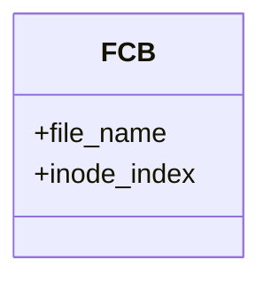
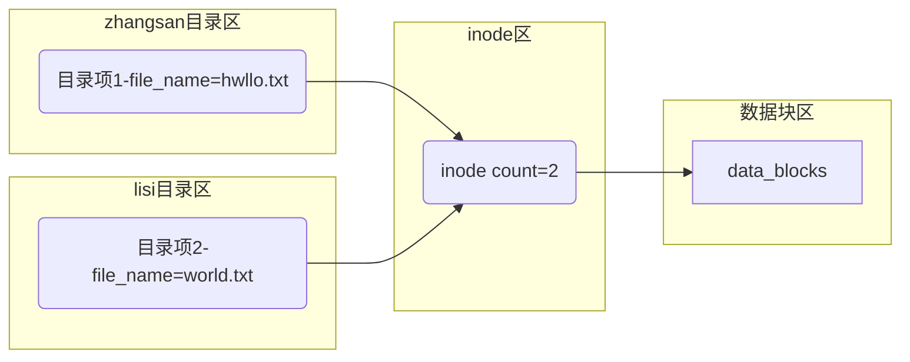
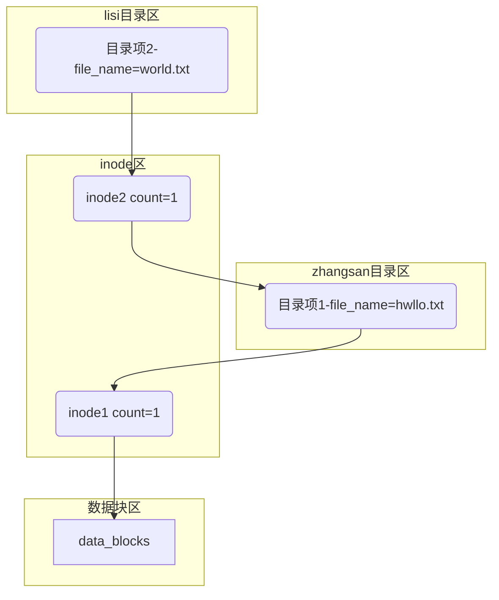

命令摘要：
- ln:链接
## Linux文件与目录
### 文件目录结构

| 目录  | 全称                   | 作用                   |
| ----- | ---------------------- | ---------------------- |
| usr   | Unix Software Resource | 建议用来存放所有的软件 |
| home  |                        | 普通用户的目录         |
| root  |                        | root用户所在目录       |
| mnt   | mount                  | 挂载设备，如U盘等      |
| media | mount                  | 挂载媒体设备，如光盘等 |
| bin   |                        | 存放系统的各个命令     |
| etc   |                        | 存放配置文件           |
| dev   |                        | 存放设备文件           |

### 文件命名规则
- 除了"/"字符之外，所有字符都可以使用，但是使用一些特殊字符会造成很多麻烦。

使用**空格，<,>,?,*,非打印字符**进行文件命名，在访问文件时会产生很多不必要的麻烦。如访问`hello world.txt`,必须使用转义字符进行转义或者使用引号。

- 目录名区分大小写，但是不建议

文件名区分大小写，但是不建议使用字符大小写区分不同文件。

- 扩展名无意义

不同于Windows，Linux系统中，文件的扩展名毫无意义。`hello.txt`与`hello.mp4`并无区别。Linux系统中，并不以文件的扩展名区别文件类型。

## Linux文件系统
### 文件存储结构
#### 几个重要的概念
&emsp;&emsp;对于操作系统来说，文件的组织有几个重要的概念。目录,目录项,文件控制块,索引节点inode.

| 名称   | 作用                                            |
| ------ | ----------------------------------------------- |
| 目录   | 实质也是一个文件,目录是目录项构成的线性表       |
| 目录项 | 和文件控制块FCB相近,存放着文件的名称和inode指针 |
| inode  | 存放着文件的元数据                              |
| 数据块 | 文件的内容存放在磁盘的数据块之中                |
#### 目录和目录项
Linux系统的目录项是由<font color=yellow>**文件名**</font>和<font color=yellow>**inode指针**</font>构成的数据结构,目录项也可以称之为<font color=red>文件控制块FCB</font>.Windows系统的**FCB**包括的信息包括文件名和inode中保存的信息,而Linux中将除文件名的其他信息都存放到了**inode**节点中.Linux中目录项的类图为:
<div align=center>


</div>

#### inode
&emsp;&emsp;inode节点记录了文件的元数据,其中最重要的一个信息就是文件内容在系统数据块区的位置.可以使用`stat`命令,查看一个文件的`inode`的信息.如:
```
qingbin@Pc-QingBin:~$ stat paper.pdf
File: paper.pdf                             # 文件名
Size:  373939                               # 文件大小
Blocks: 736                                 # 为文件分配的磁盘块数
IO Block: 512                               # 每个块的大小,以字节(KB)为单位
regular file                                # 文件的类型
Device: 2h/2d                               # 设备编号,在Linux中,设备也是文件
Inode: 3377699720594374                     # inode的索引号,index
Links: 1 # 硬链接的数量
Access: (0777/-rwxrwxrwx)                   # 文件的访问权限
Uid: ( 1000/ qingbin)                       # 所有者的id
Gid: ( 1000/ qingbin)                       # 所有者的组id
Access: 2022-05-31 12:17:07.662225600 +0800 # 最近访问时间
Modify: 2021-07-03 16:47:00.201650800 +0800 # 最近修改时间
Change: 2021-07-03 16:47:00.201650800 +0800 # 更改数据
Birth: -
```

 &emsp;&emsp;实际上,使用`ls -l`命令查看文件的详细信息时,其先查找文件的`inode index`,然后根据`index`从索引区中查询文件的其他信息.
#### 目录项,inode,data block之间的关系
&emsp;&emsp;一个文件可以被多个用户共享,他们并不需要使用额外的创建文件inode,数据块等,只需要在自己的目录上加入一个目录项就行,目录项中文件的名字可以随意取.
<div align=center>



</div>

&emsp;&emsp;这种硬链接形式的文件共享,在inode节点的引用计数器count=0时会删除文件.


#### 软链接与硬链接
##### 硬链接
###### 硬链接介绍
&emsp;&emsp;硬链接是<font color=yellow>**目录项**</font>指向<font color=yellow>**inode**</font>的一个指针.一个文件只有一个<font color=yellow>inode</font>节点,通过多个目录项指向同一个<font color=yellow>inode</font>,可以实现文件的共享.<font color=yellow>inode</font>节点中通过设置<font color=yellow>**引用计数器count**</font>记录有多少个目录项指向该inode,当<font color=yellow>count=0</font>时,说明没有目录项引用,因此就会删除该文件.
<div align=center>

<h5>硬链接示意图</h5>


</div>

###### ln命令创建硬链接
&emsp;&emsp;Linux中使用`ln`命令创建链接,实现文件共享.在目录中,创建`hello.txt`,使用`ln`命令创建硬链接.
```
$ touch hello.txt
$ ls -l hello.txt
-rw-r--r-- 1 qingbin qingbin 0 Jun  2 12:02 hello.txt
$ ln hello.txt hello_world.txt
$ ls -li
total 0
2533274790550902 -rw-r--r-- 2 qingbin qingbin 0 Jun  2 12:02 hello.txt
2533274790550902 -rw-r--r-- 2 qingbin qingbin 0 Jun  2 12:02 hello_world.txt
```

&emsp;&emsp;可以看出使用`ln`命令创建硬链接时,由`hello.txt`创建的`hello_world.txt`与`helo.txt`使用的是同一个`inode index`,因此两个文件的各个信息,如权限,修改时间等信息都是相同的.因为有两个目录项:`hello.txt`和`hello_world.txt`共同指向了`inode index=2533274790550902`的索引节点,因此该inode的引用计数器`count=2`.

##### 软链接
###### 软链接介绍
&emsp;&emsp;软链接类似于Windows中的快捷方式,他创建一个额外的文件,指向原有目录项,又叫做<font color=red>**符号链接**</font>.
<div align=center>

<h5>软链接示意图</h5>



</div>

###### `ln -s`创建软链接
&emsp;&emsp;对于上面所创建的文件,使用`ln -s`命令创建软链接文件`hello_sl.txt`,其结果为:
```
$ ln -s hello.txt hello_sl.txt
$ ls -li
total 0
2533274790550902 -rw-r--r-- 2 qingbin qingbin 0 Jun  2 12:02 hello.txt
2533274790550904 lrwxrwxrwx 1 qingbin qingbin 9 Jun  2 12:37 hello_sl.txt -> hello.txt
2533274790550902 -rw-r--r-- 2 qingbin qingbin 0 Jun  2 12:02 hello_world.txt
```
&emsp;&emsp;可以看出,对于原始文件`hello.txt`与创建的软链接文件`hello_sl.txt`指向的是不同的<font color=yellow>**inode**</font>,且新建软链接文件并不增加`hello.txt`目录项所指向的<font color=yellow>**inode**</font>的引用计数器<font color=yellow>**count**</font>数值不变.

### 文件存储结构
Linux使用ext作为文件系统,ext磁盘在磁盘的布局上为


 Block group的核心结构为:

 <div align=center>

 ``` mermaid
 flowchart LR
    subgraph block_group
        subgraph 超级块
        end
        subgraph inode表
        end
        subgraph 数据块
        end
    end

 ```
 </div>

## REFERENCE
1. [inode详解](https://blog.csdn.net/m0_61705102/article/details/123760663)
2. [Linux stat命令详解](https://www.11meigui.com/2021/linux-stat-command.html)
3. [Ext4 Disk Layout](https://ext4.wiki.kernel.org/index.php/Ext4_Disk_Layout)