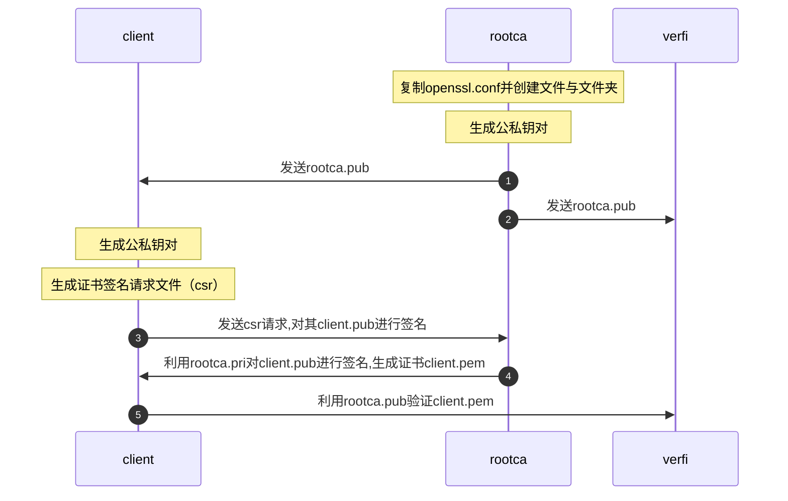

> 数字证书认证机构（英语：Certificate Authority，缩写为 CA），也称为电子商务认证中心、电子商务认证授权机构，是负责发放和管理数字证书的权威机构，并作为电子商务交易中受信任的第三方，承担公钥体系中公钥的合法性检验的责任。

> 数字证书的作用是证明证书中列出的用户合法拥有证书中列出的公开密钥。CA 机构的数字签名使得攻击者不能伪造和篡改证书。它负责产生、分配并管理所有参与网上交易的个体所需的数字证书，因此是安全电子交易的核心环节。

从商业CA获取数字证书要钱，此时可以自己当root CA，为自己发布证书。

# 基本规范

| 文件后缀 | 含义                                                       |      |
| -------- | ---------------------------------------------------------- | ---- |
| .key     | 表示这个文件里面的是私钥                                   |      |
| .crt     | 表示文件是一个证书文件                                     |      |
| .pem     | 表示这是一个使用pem格式编码的文件,内容可以是私钥或者是证书 |      |
| .csr     | 表示这是一个证书请求文件                                   |      |


# x.509证书

证书所包含的主要信息除了公钥的签名算法,还有:

信息类型|作用
-|-
公钥 |非对称密码中的公钥。公钥证书的目的就是为了在互联网上分发公钥。
身份信息|公钥对应的私钥持有者的信息，域名以及用途等。
签名信息|对公钥进行签名的信息，提供公钥的验证链。可以是CA的签名或者是自签名，不同之处在于CA证书的根证书大都内置于操作系统或者浏览器中，而自签名证书的公钥验证链则需要自己维护（手动导入到操作系统中或者再验证流程中单独提供自签名的根证书）。
有效性信息|证书的有效时间区间，以及CRL等相关信息。


通过`openssl x509`命令可以将证书的内容解析成文本


# 成为root CA

## 添加配置文件并创建所需的文件

在一个工作目录中，要成为CA，需要用到`/usr/lib/ssl/openssl.cnf`,因此需要先拷贝。


拷贝文件之后，需要创建配置文件中些的文件夹和文件：

```shell
dir = ./demoCA # Where everything is kept
certs = $dir/certs # Where the issued certs are kept
crl_dir = $dir/crl # Where the issued crl are kept
new_certs_dir = $dir/newcerts # default place for new certs.
database = $dir/index.txt # database index file.
serial = $dir/serial # The current serial number
```

index.txt,创建空文件，serial文件，内容需要时字符串格式的:`echo '1000' > serial`

## 数字证书认证机构

`openssl req -new -x509 -keyout ca.key -out ca.crt -config openssl.cnf`


`ca.key`:包括ca的私钥，`ca.crt`包括了公钥证书。

openssl req命令:生成csr,验证csr,生成自签名证书

生成csr时需要生成私钥,不用公钥,因为会自动从私钥中提取公钥.


| 选项 | 含义                 |
| ---- | -------------------- |
| -new | 说明生成证书请求文件 |
 -x509   |说明生成自签名证书
 -key    |指定已有的秘钥文件生成秘钥请求，只与生成证书请求选项-new配合。
 -newkey |-newkey是与-key互斥的，-newkey是指在生成证书请求或者自签名证书的时候自动生成密钥，然后生成的密钥名称由-keyout参数指定。当指定newkey选项时，后面指定rsa:bits说明产生,rsa密钥，位数由bits指定。 如果没有指定选项-key和-newkey，默认自动生成秘钥。
 -out    |-out 指定生成的证书请求或者自签名证书名称
 -config |默认参数在ubuntu上为 /etc/ssl/openssl.cnf, 可以使用-config指定特殊路径的配置文件
 -nodes  |如果指定-newkey自动生成秘钥，那么-nodes选项说明生成的秘钥不需要加密，即不需要输入passphase.   
 -batch  |指定非交互模式，直接读取config文件配置参数，或者使用默认参数值     


# 为客户签发数字证书


``` shell
openssl genrsa -des3 -out server.key 1024
```

`openssl genrsa`:生成rsa私钥,不会生成公钥,因为公钥会自动从私钥中提取

```shell
openssl req -new -key server.key -out server.csr -config openssl.cnf
```
通过输入客户端的私钥,来生成csr文件
输入密码，密码是上一步生成公私钥对是输入的密码.


```shell
openssl ca -in server.csr -out server.crt -cert ca.crt -keyfile ca.key -config openssl.cnf
```

需要输入密码，密码是生成ca.key时输入的密码

# PKILabServer.com网站中使用PKI

``` shell
# 将网站私钥和证书放在同一个文件中
cp server.key server.pem
cp server.key server.pem
# 使用server.pem运行web 服务器
openssl s_server -cert server.pem -www
```

通过上述操作,网站就使用了自发的证书.此时在浏览器中访问该网站就会提示证书信息.因为root CA自己的证书并不像官方的CA证书,浏览器无法识别如果要正常访问,就需要在客户端浏览器中导入ca.crt




# 创建数字签名

一般过程:

用户生成自己的公私钥对;
构造自己的证书申请文件,符合 PKCS#10 标准。该文件主要包括了用户信息、公钥以及一些可选的属性信息,并用自己的私钥给该内容签名;
用户将证书申请文件提交给 CA;
CA 验证签名,提取用户信息,并加上其他信息(比如颁发者等信息),用 CA 的私钥签发数字证书;
说明:数字证书(如x.509)是将用户(或其他实体)身份与公钥绑定的信息载体。一个合法的数字证书不仅要符合 X509 格式规范,还必须有 CA 的签名。用户不仅有自己的数字证书,还必须有对应的私钥。X509v3 数字证书主要包含的内容有:证书版本、证书序列号、签名算法、颁发者信息、有效时间、持有者信息、公钥信息、颁发者 ID、持有者 ID 和扩展项。

Common Name应与域名保持一致

``` shell
$ cd                                                                                     
$ mkdir digest                                                                   
$ cd digest                                                                       
$ echo "i love shiyanlou" > example.txt

# 产生数字摘要。这里我设置的密码为 shiyanlou
$ openssl genrsa -des3 -out myrsaCA.pem 1024             
Generating RSA private key, 1024 bit long modulus
.............++++++
.......................................................................................++++++
e is 65537 (0x10001)
Enter pass phrase for myrsaCA.pem:
Verifying - Enter pass phrase for myrsaCA.pem:

# RSA 密钥对
$ openssl rsa -in myrsaCA.pem -pubout -out myrsapubkey.pem                                   
Enter pass phrase for myrsaCA.pem:  #输入密码 shiyanlou
writing RSA key

# 使用 sha256 进行签名
$ openssl dgst -sha256 -out example.sha256 -sign myrsaCA.pem example.txt                     
Enter pass phrase for myrsaCA.pem:  #输入密码 shiyanlou

# 查看目录下文件
$ ls                                                                                         
example.sha256  example.txt  myrsaCA.pem  myrsapubkey.pem

# 验证签名
$ openssl dgst -sha256 -signature example.sha256 -verify myrsapubkey.pem example.txt         
Verified OK
```

数字签名的一般流程：使用私钥对消息只要进行签名，使用公钥进行解密并重新进行计算摘要，比较两者是否相等。


证书的使用流程


参考

1. [最新OpenSSL简明教程_黒木涯的博客-CSDN博客_openssl教程](https://blog.csdn.net/xxxlllbbb/article/details/107891790)

