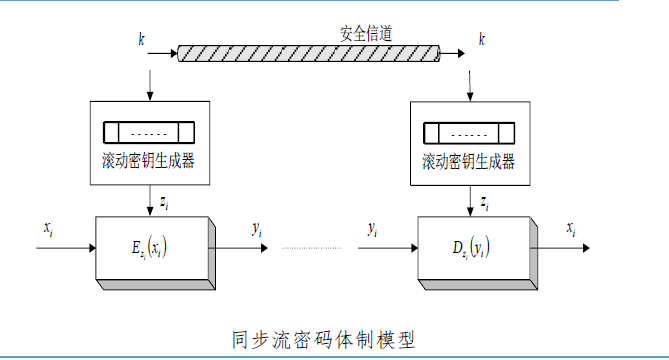
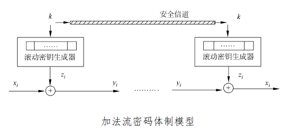

## 1. 一次一密密码
1. 加密过程

   $$
   \begin{align}
   & 明文：x=x_0 x_1 x_2 \\
   & 密钥：k=k_0k_1k_2\\
   & 密文：y=y_0y_1y_2 \\
   & 加密函数：y_i=x_i+k_i(mod26) \\
   & 解密函数：x_i=y_i-k_i(mod26) \\
   & 注：密钥为随机产生的，而且只使用一次
   \end{align}
   $$

2. 特点
   1. 特点
      1. 密钥**使用随机数序列,并且只能用一次**
   2. 优点
      1. 密码随机产生,只可使用一次
      2. 无条件安全
      3. 加密和解密算法为加法运算,效率高
   3. 缺点
      1. 密钥长度和明文一样长,难以共享,不实用
## 2. 流密码
### 基本概念和思想
1. 基本概念

明文逐字符或逐比特加密,也叫做**序列密码(Sequence Cipher)**.由于其逐个加密的特点,特别适合**基于硬件**实现.

2. 基本思想

基于密钥**K**创建一个**密码流**$z=z_0z_1z_2...$,使用**密码流**对明文串$x=x_1x_2...$进行加密,则密文**y**为:
$$
\begin{align}
& x=x=x_1x_2\dots \\
& 则由密钥流发生器f产生密钥流z_i=f(k,\sigma_i) \\
& z=z_0z_1z_2\dots \\
& 则y=y_0y_1y_2...=(Ez_0(x_0))(Ez_1(x_1))(Ez_2(x_2))\dots \\
\end{align}
$$

### 密钥流的产生
密钥流在**密钥流发生器**中发生,其数学表达为:
$$

\begin{align}
&令k为密钥,\sigma_i为加密器中记忆元件在i时刻的状态,\\

& f为由k和\sigma_i决定产生的密钥流发生器函数 \\
& z_i=f(k,\sigma_i) \\

\end{align}

$$

### 实现部件
#### 记忆元件
**加密器**中的**记忆元件**由一组**移位寄存器**构成.

### 流密码的种类
#### 同步流密码
**内部记忆元件**的状态$\sigma_i$独立于明文字符.

由于$z_i=f(k,\sigma_i)$与明文字符无关,因此密文字符$y_i=Ez_i(x_i)$也**不依赖于此前的明文字符**.

同步流密码的加密器可以分为**密钥流产生器**和**加密变换器**两个部分.

##### 体制模型

#### 自同步流密码

**内部记忆元件**的状态$\sigma_i$与明文字符有关

### 常见的流密码体制
区别密码体制的标准,主要是**加密算法**和**密钥**
#### 二元加法流密码体制
是一种使用$y_i=z_i \oplus x_i$的加密变换方法的密码体制,也是当前最常用的流密码体制.其示意图为:

