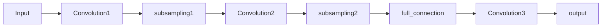

### 1. LeNet5网络综述
  LeNet5网络是一个含有5个隐藏层的卷积神经网络 **(Convolutional Neural Network,CNN)**,其基本的网络结构为

### 2. LeNet5网络的基本思想
  LeNet5网络具有卷积神经网络的各种结构,其主要的组成结构为:
  - 输入层

  - 卷积层Convolution:实现特征提取,其需要设置的参数有
    - 卷积的层数:可以使用多个卷积核,实现多通道卷积,获取不同维度的特征
    
    - 卷积核的大小:一般倾向于使用小卷积核,深层次的神经网络,卷积核大小一般都是奇数,其原因有:
      - 奇数卷积核,更容易实现padding操作,假设卷积核(滤波器-filter)大小为f,padding的大小为p,卷积移动的步长为s,则有
        $$
        n_{out}=\lfloor \frac {n_{in}+2p-f}{s}+1\rfloor \\
        $$
      
      - 更容易找到锚点。在CNN中，一般会以卷积核的某个基准点进行窗口滑动，通常这个基准点是卷积核的中心点，所以如果k'是偶数，就找不到中心点了

  - 池化层/subsampling/pooling:实现下采样,进行数据降维
  - 全连接层:对得到的特征图进行运算,训练参数,得到输出
  - 输出层:常见的分类任务中,有多少个可能的输出,就有多少个输出节点,如手写体数字识别的分类任务中,输出节点的个数为10个
### 3. LeNet5层次结构分析
  1. 输入层

     - 原始图像为28×28的灰度图,使用大小为2的padding,则padding之后的图像大小为28+2×2=32的方阵
     - padding大小的设置:考虑后一步的卷积核大小,卷积核大小为5,则padding大小为2

  2. Convolution1
     - 卷积核大小设置:卷积核大小设置为5×5的卷积核,在padding为2的基础上,锚点正好在中间
     
     - 卷积通道的个数:设置6个不同卷积核,提取6个不同方向特征
     
     - 参数的计算
     
       - 每个卷积神经元参数数目
         $$
         卷积核大小为5×5,则每个神经元的参数为
         \\ 5×5+1bias=26
         $$
     
       - Convolution1的全部参数个数
         $$
         6×(5×5+1)=156
         $$
     
       - 输入层与卷积层的连接个数
         $$
         \begin{aligned}
         & n_{out}=\lfloor \frac {n_{in}+2p-f}{s}+1\rfloor \\
         & 带入n_{in}=28,s=1,p=2,f=5,得n_{out}=28. \\
         & 则有C1层feature map=6@28×28 \\
         & 则C1层同input层得连接数为:\\
         & connection=(5×5)×(28×28)×6=19600
         \end{aligned}
         $$