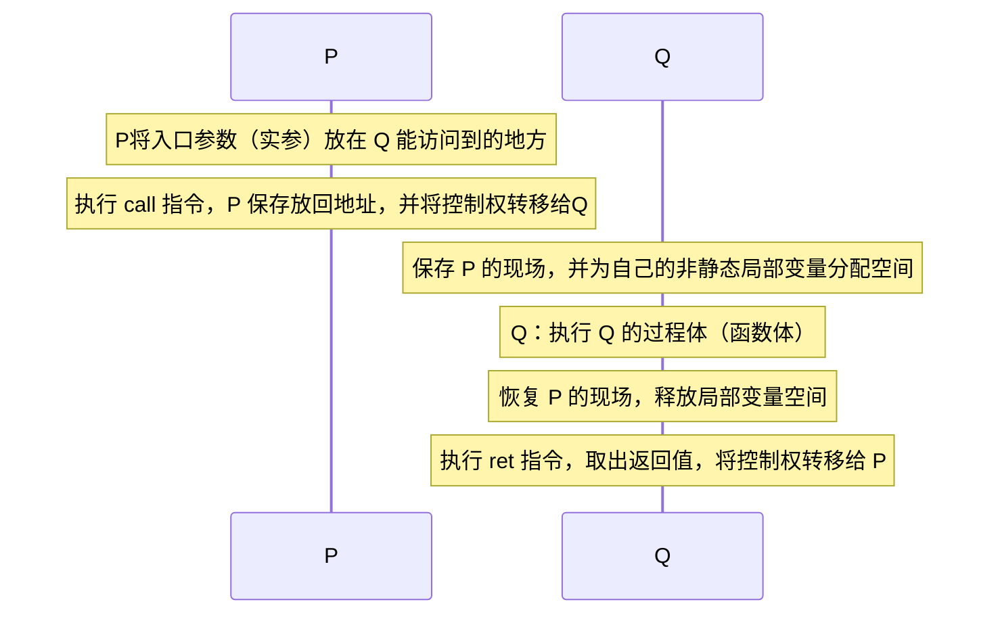
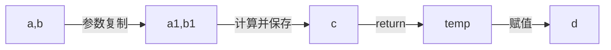

关于c++函数定义和参数传递问题.

# 函数定义规范

- 一开始就需要对输入数据进行检查

# 过程调用的表示

## 过程调用的机器级表示

操作系统中，可执行文件的存储映像为：


过程调用中，内存用户栈的表示为：


函数调用的过程：

| item           | 含义                                             |
| -------------- | ------------------------------------------------ |
| 参数           | 函数的实参                                       |
| 被保存的寄存器 | 被调用者Q保存调用者P的现场信息，主要是寄存器的值 |
| 局部变量       | 函数执行过程中定义的局部变量                     |
| 返回地址       | 调用者的执行位置，即旧的esp/isp                  |
| 被保存的寄存器 | 最多可以寄存6个32位参数，多余的需要存在参数区    |

过程：P调用Q

- 扩展空间：p将Q的参数写入寄存器或Q栈帧的参数区（寄存器最多可以存6个），给局部变量分配空间，并将P执行位置作为Q的返回地址写入Q的栈帧。（**栈中的参数必须内存对齐，64位机中存放的起始地址必须位8的倍数**）。
- P保存现场：将P运行时的寄存器的值保存在P的栈帧中，因为寄存器是共享的物理设备。

**二、过程调用的执行步骤**（P为调用函数，Q为被调用函数）

1. P：P将入口参数（实参）放在 Q 能访问到的地方
1. P：执行 call 指令，P 保存放回地址，并将控制权转移给Q
1. Q：保存 P 的现场，并为自己的非静态局部变量分配空间
1. Q：执行 Q 的过程体（函数体）
1. Q：恢复 P 的现场，释放局部变量空间
1. Q：执行 ret 指令，取出返回值，将控制权转移给 P 

将控制从函数 P 转移给 Q 值需要简单地把程序计数器（PC）设置为 Q 的代码的起始位置，反之亦然。



过程调用中，内存的变化情况为（省略了多余的参数，假设只有6个变量，因此没有画Q的参数）


**REFENCE**:

[过程调用的机器级表示_葡萄籽PP的博客](https://blog.csdn.net/www_chinese_com/article/details/90741080)

[在出栈函数的形参_用一个实例来深入剖析函数进栈出栈的过程](https://blog.csdn.net/weixin_32767591/article/details/113412050)

## 过程调用与函数的执行过程

1. P：P将入口参数（实参）放在 Q 能访问到的地方供Q将所需用的参数放在寄存器或者参数区中
1. P：执行 call 指令，P 保存放回地址，并将控制权转移给Q
1. Q：保存 P 的现场，并为自己的非静态局部变量分配空间
1. Q：执行 Q 的过程体（函数体），**将实参从P的栈中复制到寄存器或自己的栈中**
1. Q：恢复 P 的现场，释放局部变量空间
1. Q：执行 ret 指令，取出返回值，将控制权转移给 P 

因此有：Q执行时，会将所需用的参数，从P的栈中复制到寄存器或自己的栈中，即，C/C++默认是使用值传递的方式。

当函数返回时，执行ret指令，此时会销毁Q的用户栈，因此Q中的局部变量和复制的参数也会被销毁。**但是，这里所谓的销毁并不是将局部数据所占用的内存全部抹掉，而是程序放弃对它的使用权限，弃之不理，后面的代码可以随意使用这块内存。因此，如果后续没有其他程序覆盖这篇内存，那么仍然可以获取局部数据。**

SOURCE：http://c.biancheng.net/view/2015.html

# 函数传参问题

**c++**中一共有**3种**传参方式，分别是**值传递**，**引用传递**和**指针传递**三种方式。其中**值传递**是**c++**默认的传递方式，这点和**Java**不同，Java中，基本数据类型使用值传递，而对象使用引用传递。

## 引用和指针

### 引用

使用**`&`**的核心目的是为了使用**引用传递**,减少**值传递**带来的拷贝开销等,也为了能够直接对对象进行修改.因为c++默认是采用**值传递**的方式,这样会造成一个函数操作的是一个对象的副本,而没有对原对象进行修改.使用**引用**可以达到**在函数内部影响函数外部数据**的效果

引用(&):实质就是为一个变量起了别名,即:

``` c++
int a=0;
int &b=a;//&表示这是引用,相当于起了一个别名
// &b== &a
```

定义的引用和原变量是同一个地址.

使用引用传递的方式定义和使用函数

### 引用和指针的区别

下段摘自:[C++ 值传递、指针传递、引用传递详解 - zqlucky - 博客园 (cnblogs.com)](https://www.cnblogs.com/dingxiaoqiang/p/8012578.html)

从编译的角度,指针和引用的区别为:

> 程序在编译时分别将指针和引用添加到符号表上，符号表上记录的是变量名及变量所对应地址。
>
> 指针变量在符号表上对应的地址值为指针变量的地址值
>
> 而引用在符号表上对应的地址值为引用对象的地址值。
>
> 符号表生成后就不会再改，因此指针可以改变其指向的对象（指针变量中的值可以改），而引用对象则不能修改。

|        | 引用                                  | 指针               |
| ------ | ------------------------------------- | ------------------ |
| 定义   | 对原变量的一个别名,两者指向同一个地址 | 一个存储地址的变量 |
| 级别   | 只能引用一级,`int &&a`是非法的        | 可以多级指向       |
| 初始化 | 必须在定义的时候进行初始化            | 可以在使用时初始化 |
| 可变性 | 初始化之后不可变                      | 初始化之后可变     |

参考:https://zhuanlan.zhihu.com/p/140966943

### 值传递,指针传参和引用传参

#### 值传递

使用值传递，实参是一个副本。不会更改原函数的值。c中所有的数据默认都是使用值传递的方式，而Java中为基本数据类型为值传递，复合数据类型使用引用传递。

#### 指针传参

指针传参实质是一种**值传递**的方式,不过他是传递一个**地址**.因此,在这种情况下,如果将一个指针变量作为实参,函数将不会修改指针变量的值.

``` c++
int a = 955;
int *pa = &a;

void change(int * pa){
    int b = 100;
    pa = b;
}
```

#### 引用传参

引用传参:引用实质就是调用的原来的变量,因此函数可以改变引用实参的值.注意：**只有变量才能使用引用传递进行传参**。

``` c++
// 使用引用传递方式传参
void getNum(int &userNum)
{
    cout << "Enter a number: ";
    cin >> userNum;
}
// 引用作为返回值
int& getNumber(int& number){
    return number;
}
// 调用使用引用传递进行传参的函数
int main()
{
    int value;
    // Call getNum to get a number and store it in value
    getNum(value);
    // Display the resulting number
    cout << "That value doubled is " << value << endl;
    return 0;
}
```

#### 值传递，引用传递，指针传递的区别

**值传递**：

> 值传递过程中，被调函数的形式参数作为被调函数的局部变量处理，即在栈中开辟了内存空间以存放由主调函数放进来的实参的值，从而成为了实参的一个副本。值传递的特点是被调函数对形式参数的任何操作都是作为局部变量进行，不会影响主调函数的实参变量的值。（这里是在说实参指针本身的地址值不会变）

**指针传递**

> 指针传递参数本质上是值传递的方式，它所传递的是一个地址值。

**引用传递**

>被调函数的形式参数虽然也作为局部变量在栈中开辟了内存空间，但是这时存放的是由主调函数放进来的实参变量的地址。被调函数对形参的任何操作都被处理成间接寻址，即通过栈中存放的地址访问主调函数中的实参变量。正因为如此，被调函数对形参做的任何操作都影响了主调函数中的实参变量。


## const参数问题

使用`const`的核心目的是为了保护数据不被改动.

`const`定义一个常量,声明的同时**必须**进行初始化.一旦声明,值就不可更改.

### 常量指针和指针常量
例如:`const int *`代表**指向常量的指针**,本质上还是一个指针变量,变量的值可以修改,但是该指针指向一个常量,可以断句为`(const int)*`

`int* const`表示**常量指针**,可以断句为:`int* const`,,即这个指针是常量,即一旦初始化指针之后,指针的值不可改变


## 数组作为函数参数

### 数组的特殊性质

- #### 不允许拷贝和复制

  不能将数组的内容拷贝给其他数组作为其初始值，也不能用数组为其他数组赋值。

``` c++
int a[] = {0,1,2};    // 含有三个整数的数组
int s2 = a;           // 错误：不允许使用一个数组初始化另一个数组
a2 = a;               // 错误：不能把一个数组直接赋值给另一个数组
```

- #### 使用数组时通常将其转化成指针

在C++语言中，指针和数组有非常紧密的联系。使用数组的时候编译器一般会把它转换成指针。

``` c++
//尽管形式不同，但这三个print函数是等价的
//每个函数都有一个const int*类型的形参
void print(const int*);
void print(const int[]);
//这里的维度表示我们期望数组含有多少元素，实际不一定
void print(const int[10]); 
```


### 使用数组作为函数参数的示例

一个n维数组作为形参,需要写出n-1维的shape。

数组名实质是一个常量指针，因此当数组作为函数的参数时，函数体内并不知道数组的长度。因此在用数组作为函数的参数时，一般要传递两个信息：**数组的首地址**和**数组的长度**。（具体解释参见：http://c.biancheng.net/view/207.html）

https://wangjunstf.github.io/2021/08/13/c-yu-yan-shu-zu-zuo-wei-han-shu-can-shu/

``` c
#include <stdio.h>
int arrayPrint(int arr[][3],int row,int column);
int main(){
    int array[3][3] = {{1,2,3},{4,5,6},{7,8,9}};
    arrayPrint(array,3,3);
}


int arrayPrint(int arr[][3],int row,int column){
    for(int i=0;i<row;i++){
        for(int j=0;j<column;j++){
            printf("%d ",arr[i][j]);
        }
        printf("\n");
    }
    return 0;
}
```

## 数组指针作为函数参数

数组指针：指向数组的指针

``` c
#include <stdio.h>
int main(){
    int arr[] = { 99, 15, 100, 888, 252 };
    int i, *p = arr, len = sizeof(arr) / sizeof(int);
    for(i=0; i<len; i++){
        printf("%d  ", *(p+i) );
    }
    printf("\n");
    return 0;
}
```

因此，使用数组指针时遍历数组的方法有：

1. 使用下标

   可以将数组指针当作数组名使用，因此可以使用`p[i]` 的形式进行数据的访问。

2. 使用指针

   即使用 `*(p+i)` 的形式进行访问。

   SOURCE：http://c.biancheng.net/view/1993.html

   ### `*p++`，`*++p`,`(*p)++`的含义

   | 形式   | 等价形式 | 含义                                                         |
   | ------ | -------- | ------------------------------------------------------------ |
   | *p++   | *(p++)   | 表示先取得第 n 个元素的值，再将 p 指向下一个元素             |
   | *++p   | *(++p)   | 会先进行 ++p 运算，使得 p 的值增加，指向下一个元素，整体上相当于 *(p+1)，所以会获得第 n+1 个数组元素的值 |
   | (*p)++ |          | 会先取得第 n 个元素的值，再对该元素的值加 1                  |

   由此可以看出，`*`运算符的优先级比较低，至少比自增自减符的优先级低

# 函数返回值问题

- 千万不要返回局部对象的引用，当函数执行完毕时，将释放分配给局部对象的存储空间。此时，对局部对象的引用就会指向不确定的内存。
- 千万不要返回指向局部对象的指针，一旦函数结束，局部对象被释放，返回的指针就变成了指向不再存在的对象的悬垂指针
- 引用返回左值，返回引用的函数返回一个左值，因此，这样的函数可用于任何要求使用左值的地方：

REFERENCE：

1. [C语言return返回值深入理解](https://www.cnblogs.com/xbook-ben/p/10902299.html)
2. https://haicoder.net/c/c-function-return-pointer.html

## 常见的与函数返回值有关的错误

### 使用指向局部变量的指针作为返回值

对于：https://haicoder.net/c/c-function-return-pointer.html 中给出的典型错误案例在不同平台上运行情况为：

``` c
#include <stdio.h>
int *arrSize()
{
	int size = 100;
	return &size;
}
int main()
{
    printf("嗨客网(www.haicoder.net)\n\n");
    int *pSize = arrSize();
    printf("return local address\n");
    printf("pSize = %d\n", *pSize);
    return 0;
}
```

在Windows上，其编译运行符合预期的结果


在Linux上，其结果为：


而在Linux上，返回的是一个野指针。


结论：不同编译器上，使用一个指针指向局部变量，结果不同，但是最好还是不要返回一个指向局部变量的指针。原因是：销毁局部数据并不是将该内存区域的值都置为0，而是放弃对该内存区域的使用权。因此，如果没有新的程序覆盖了栈帧的话，仍然可以用指向局部变量的指针获取该局部变量的值。这就是为什么在Windows上获取到了局部变量的值，而Linux上显示该指针是一个野指针。

解析详查：http://c.biancheng.net/view/2015.html

### 返回值时的拷贝构造与销毁引发的调用构造函数的析构函数而引发的问题

本案例参见：[C++中函数返回值与拷贝_白给程序猿的博客-CSDN博客_c++函数return指针是拷贝吗](https://blog.csdn.net/qq_39913402/article/details/105939391)

注意：该例子中，解释有问题，比较有信服力的在评论区，但是例子可以用。在该案例中，临时对象构造和销毁时候分别调用了构造函数和析构函数。在该案例中，注释掉22行的`delete`语句，发现结果如同`Man get(Man& m)`。

``` c++
#include <stdio.h>
#include <iostream>

using namespace std;

class Man
{
public:
	Man() {
		cout << "构造" << endl;
		data = new int(0); }

	Man(const Man& m)
	{
		cout << "拷贝构造" << endl;
		this->data = m.data;
	}
	
	~Man() 
	{ 
		cout << "析构" << endl;
		//delete data; 
	}
	
	int* data;
};
Man get(Man& m)
{
	cout << "----" << endl;
	return m;
}
 int main()
{
		Man m, n;
		//cout << "before m=" << &m << "n=" << &n << endl;
		*m.data = 5;
		printf("m.data is %d\n", *m.data);
		n = get(m); 

		printf("m.data is %d\n", *m.data);
		printf("n.data is %d\n", *n.data);
	
	    system("pause");
	    return 0;
 }
```


## 返回值

最常用的一种方式：

``` c++
int add(int a,int b){
    int c= a+b;
    return c;
}
int main(){
    int a=2;
    int b=1;
    int d=sum(a,b);
}
```

此种函数的执行过程中，因为c是函数add() 的局部变量，当add()执行结束后就会被销毁，因此在调用`return`时，系统会创建一个临时的全局变量，然后使用**复制构造**函数完成构造，之后就会释放栈空间，在销毁临时对象时，会调用临时对象的析构函数。当return这个因此在上例中，函数的执行过程为：





## 返回指针

函数也可以使用指针作为返回值，这种函数也叫做**指针函数**，但是在使用指针作为返回值时，有些问题需要注意：

1. 不能返回指向局部变量或者栈空间中保存的对象的指针，否则在return时会清空栈，这个时候就会导致返回野指针，导致`segmentation fault`
2. 使用new创建的对象保存在堆中，因此函数执行完成清空函数调用栈的时候并不会影响到堆，因此可以将指向使用new创建的对象的指针作为函数的返回值。但是常规的数组也是在栈中，因此不能返回数组，也不能

## 返回引用

### 返回引用的基本规则和场景

使用引用做函数返回值的最大好处是，在内存中不产生被返回值的副本。如果直接返回对象的话,会先生成一个临时变量,再交付临时变量。

返回引用的基本规则：

>- 不能返回函数内部 new 分配的内存的引用:不是完全不行，而是这种情况很容易产生内存泄漏，因为这样的话，违背了谁申请，谁释放的原则，容易因为忘记delete而造成内存泄漏。编程习惯不好。
>- 不能返回局部变量的引用
>- 可以返回类成员的引用，但最好是 const
>- 要想返回一个变量而不是一个拷贝,则必须要保证引用的有效性,即引用的对象不能为`NULL`

返回引用的常见场景：

> 引用方式返回最常用的是由**引用参数传递过来的变量**，其次是**全局变量**，这样返回的变量地址才是有效的

### 使用引用的典型情况

#### 复制构造函数

##### 复制构造函数的参数必须采用引用

在C++中按值传递一个参数时，会在函数中重新分配一块内存建立与参数同类型的变量或对象，再把参数的数据成员赋值给新的变量或对象。在建立这个对象时，编译器就会自动为这个对象调用复制构造函数。如果其参数是真实的对象而不是引用，则又会引入新的一轮调用复制构造函数，出现了无穷递归。

#####  复制构造函数被调用的时机

- 拷贝构造时

  > 当用一个类的对象去初始化该类的另一个对象（或引用）时系统自动调用拷贝构造函数拷贝赋值。

- 函数参数传递对象时

  > 若函数的形参为类对象，调用函数时，实参赋值给形参，系统会自动调用复制构造函数

- 返回对象时

  > 当函数的返回值是类对象时，系统自动调用复制构造函数

#### 操作符重载

`operator= `时，需要返回自身的引用而不能是自身的复制。如果返回自身的复制，则会调用拷贝构造函数生成一个临时对象作为返回值，浪费资源。

``` c++
// operator=返回自身应用
class Person{
public:
	Person(int id):m_id}{id}{
	}
	Person& operator=(const Person &p){
		this->m_id = p.m_id;
		return *this;//因为this是一个指向自身的指针，因此返回本身的应用时，需要使用简介寻址运算符*取数
	}
private:
	int m_id = o;
};

Person p(1);
Person p2(2);
Person p3(3);
(p = p2) = p3;	//  B

```


## 不同返回方式的比较

| 返回方式 | 特点                                                         | 缺点                                                         | 应用                         |
| -------- | ------------------------------------------------------------ | ------------------------------------------------------------ | ---------------------------- |
| 返回值   | 它的操作主要在栈上，变量a在函数结束后会删除，为了返回a的值，系统会在内部建立一个临时变量保存a的值。<br />返回的是一个右值，不能进行运算符操作<br />生成临时对象时会调用其构造函数，销毁时也会调用其析构函数 | 如果返回大的对象就会占用很大的数据类型                       | 返回简单的数据类型           |
| 返回指针 | 返回指针是在C中除了返回值以外的唯一方式，根据函数栈的特性，也会产生复制，只是复制的是一个指针即一个地址 | 返回指针的资源的清理交给了调用者，这违反了谁申请谁销毁的原则。指针也是右值同样无法操作。 | 返回大规模的数据             |
| 返回引用 | 引用是左值，可以直接进行操作，也可以进行连续赋值             | 不能返回对局部变量的引用                                     | 拷贝构造函数<br />运算符重载 |


## 返回数组指针

[C++之返回数组指针_很黑的黑的博客-CSDN博客_返回数组指针](https://blog.csdn.net/lishun1422840684/article/details/78773203)


# REFERENCE

1. [C++基础知识（八）---函数返回值（返回值，返回指针，返回对象，返回引用）---引用---复制构造函数（拷贝构造函数）---深复制与浅复制 - long_ago - 博客园 (cnblogs.com)](https://www.cnblogs.com/southcyy/p/10256378.html)
1. [C语言指针作为函数返回值](http://c.biancheng.net/view/2015.html)
1. 
