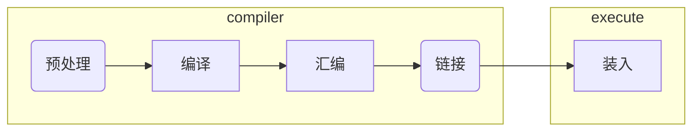

gcc编译器的编译过程




使用gcc编译器分步对一个源程序进行编译的结果步骤为：

| 选项 | 过程   | 使用工具 | 得到的结果                                                   |
| ---- | ------ | -------- | ------------------------------------------------------------ |
| -E   | 预处理 | 预处理器 | 通常用`-o a.i`来保存预处理结果,结果是一个预处理后的文件      |
| -S   | 编译   | 编译器   | 生成一个`a.s`汇编文件,文件中的是**汇编语言代码**             |
| -c   | 汇编   | 汇编器   | 将汇编语言代码转换成可执行的机器指令(文本编辑器看起来就是乱码),也叫做**可重定位目标文件** |
|      | 链接   | 链接器   | 链接其他库文件,如libscrpto.so.编译器默认会链接标准库文件，得到**可执行目标文件** |

得到**可执行目标文件**之后，如果要想运行该文件就需要使用**装入器（loader）**将可执行文件从外存读入内存之中。

>装入器（loader）：将可执行文件的代码和数据复制到内存，然后将控制转移到程序的开头。

# 链接

根据发生链接的时间，可以将链接分成三种：

| 类别                        | 特点                                       |
| --------------------------- | ------------------------------------------ |
| 编译时链接（compile time）  | 在源代码被翻译成机器代码时                 |
| 装入时动态链接（load time） | 在程序被加载器（loader）加载到内存并执行时 |
| 运行时动态链接（runtime）   | 也就是由应用程序来执行链接                 |

而要完成链接，就需要使用**链接器（linker）**,链接器主要完成了两件事，分别是：

| 任务                              | 描述                                                         |
| --------------------------------- | ------------------------------------------------------------ |
| **符号解析（symbol resolution）** | 目标文件定义和引用符号，每个符号对应于一个函数、一个全局变量或一个**静态变量**（即 C 语言中任何以 static 属性声明的变量）。符号解析的目的是将每个符号引用正好和一个符号定义关联起来。 |
| **重定位（relocation）**          | 编译器和汇编器生成从地址 0 开始的代码和数据节。链接器通过把每个符号定义与一个内存位置关联起来，从而重定位这些节，然后修改所有对这些符号的引用，使得它们指向这个内存位置。链接器使用汇编器产生的**重定位条目**（relocation entry）的详细指令，不加甄别地执行这样的重定位。 |


## 目标文件

链接器主要将**可重定位目标文件**链接成**完全链接的可执行目标文件**。存在三种目标文件，在LInux中，**这三种目标文件的类型都是*ELF（Executable and Linkable Format”，即可执行可链接文件格式）***，分别是：

| 类型                 | 特点                                                         |
| -------------------- | ------------------------------------------------------------ |
| **可重定位目标文件** | 包含二进制代码和数据，其形式可以在**编译**时与其他可重定位目标文件合并起来，创建一个可执行目标文件 |
| **共享目标文件**     | 一种特殊类型的**可重定位目标文件**，可以在**加载**或者**运行**时被**动态**地加载进内存并链接。 |
| **可执行目标文件**   | 包含二进制代码和数据，其形式可以被直接复制到内存并执行       |

###  可重定位目标文件

典型的ELF可重定位目标文件的格式为：


夹在 ELF 头和节头部表之间的都是节。一个典型的 ELF 可重定位目标文件包含下面几个节： 

| 节              | 描述                                                         |
| --------------- | ------------------------------------------------------------ |
| **.text：**     | 已编译程序的机器代码。                                       |
| **.rodata：**   | 只读数据，比如 printf 语句中的格式串和开关语句的跳转表。     |
| **.data：**     | **已初始化**的**全局和静态 **C 变量。局部 C 变量在运行时被保存在栈中，既不岀现在 .data 节中，也不岀现在 .bss 节中。 |
| **.bss：**      | **未初始化**的**全局和静态 **C 变量，以及所有**被初始化为 0 **的全局或静态变量。*在目标文件中这个节不占据实际的空间*，它仅仅是一个占位符。目标文件格式区分已初始化和未初始化变量是为了空间效率：在目标文件中，未初始化变量不需要占据任何实际的磁盘空间。运行时，在内存中分配这些变量，初始值为 0。 |
| **.symtab：**   | 一个**符号表**，它存放在程序中定义和引用的函数和全局变量的信息。一些程序员错误地认为必须通过 -g 选项来编译一个程序，才能得到符号表信息。实际上，每个可重定位目标文件在 .symtab 中都有一张符号表（除非程序员特意用 STRIP 命令去掉它）。然而，和编译器中的符号表不同，.symtab 符号表不包含局部变量的条目。 |
| **.rel.text：** | 一个 .text 节中位置的列表，当链接器把这个目标文件和其他文件组合时，需要修改这些位置。一般而言，任何调用外部函数或者引用全局变量的指令都需要修改。另一方面，调用本地函数的指令则不需要修改。注意，可执行目标文件中并不需要重定位信息，因此通常省略，除非用户显式地指示链接器包含这些信息。 |
| **.rel.data：** | 被模块引用或定义的所有全局变量的重定位信息。一般而言，任何已初始化的全局变量，如果它的初始值是一个全局变量地址或者外部定义函数的地址，都需要被修改。 |
| **.debug：**    | 一个调试符号表，其条目是程序中定义的局部变量和类型定义，程序中定义和引用的全局变量，以及原始的 C 源文件。只有以 - g 选项调用编译器驱动程序时，才 会得到这张表。 |
| **.line：**     | 原始 C 源程序中的行号和 .text 节中机器指令之间的映射。只有以 -g 选项调用编译器驱动程序时，才会得到这张表。 |
| **.strtab：**   | 一个**字符串表**，其内容包括 .symtab 和 .debug 节中的符号表，以及节头部中的节名字。字符串表就是以 null 结尾的字符串的序列。 |

>COMMON 段实际上不是一个真正的段，查看段表信息也看不到任何和 COMMON 相关的信息，COMMON 部分的信息被保存在符号表中，符号标志位为 COMM，使用 nm 指令或者 readelf -s 查看。comon和.bss区别
>
>| 段     | 保存的值                                          |
>| ------ | ------------------------------------------------- |
>| common | 未初始化的全局变量                                |
>| bss    | 未初始化的静态变量，以及初始化为0的全局或静态变量 |
>

### 可执行目标文件

**可执行目标文件**是完全链接的目标文件，它还包括程序的**入口点**（entry point），也就是当程序运行时要执行的第一条指令的地址。.init 节定义了一个小函数，叫做 _init，程序的初始化代码会调用它。因为可执行文件是**完全链接的**（已被重定位），所以它不再需要 .rel 节。

| 可重定位目标文件                                             | 可执行目标文件                                               |
| ------------------------------------------------------------ | ------------------------------------------------------------ |
|  |  |

总结：

- 可重定位目标文件：需要进行地址重定位，因此有**rel**节
- 可执行目标文件：因为完全链接，因此不需要地址重定位，因此无**rel**节，但是因为要执行，所以有**init**节


## 解析符号引用

编译器会根据程序中定义的全局函数或者变量生成对应的**符号**（函数内定义局部变量存放在栈中，不会生成符号）。**.symtab 中的符号表不包含对应于本地非静态程序变量的任何符号**。这些符号在运行时在栈中被管理，链接器对此类符号不感兴趣。

### 符号和符号表

#### 全局符号，外部符号和局部符号

根据变量和函数定义的位置以及作用域 ，可将一个目标模块m中的符号分成三种：

| 类别     | 定义                                            | 内容                                                         |
| -------- | ----------------------------------------------- | ------------------------------------------------------------ |
| 全局符号 | 由模块 m 定义并能被其他模块引用的**全局符号**。 | **非静态**的 C 函数和全局变量。                              |
| 外部符号 | 由其他模块定义并被模块 m 引用的**全局符号**     | 在**其他模块**中定义的**非静态**C 函数和全局变量。（extern） |
| 局部符号 | 只被模块 m 定义和引用的**局部符号**             | 带**static**属性的 C 函数和全局变量。这些符号在模块 m 中任何位置都可见，但是不能被其他模块引用。 |

#### 强符号和弱符号

强弱是链接的优先级，当要引用的符号有重复定义的符号时，就需要用到这个。

| 符号类别 | 含义                             |
| -------- | -------------------------------- |
| 强       | 函数和已初始化的全局变量是强符号 |
| 弱       | 未初始化的全局变量是弱符号。     |

#### 符号与符号表的示例

``` shell
$ readelf -s getopt.o
Symbol table '.dynsym' contains 16 entries:
   Num:    Value          Size Type    Bind   Vis      Ndx Name
     0: 0000000000000000     0 NOTYPE  LOCAL  DEFAULT  UND 
     1: 0000000000000000     0 FUNC    GLOBAL DEFAULT  UND abort@GLIBC_2.2.5 (2)
     2: 0000000000000000     0 NOTYPE  WEAK   DEFAULT  UND _ITM_deregisterTMCloneTab
     3: 0000000000000000     0 FUNC    GLOBAL DEFAULT  UND puts@GLIBC_2.2.5 (2)
     4: 0000000000000000     0 FUNC    GLOBAL DEFAULT  UND htons@GLIBC_2.2.5 (2)
     5: 0000000000000000     0 FUNC    GLOBAL DEFAULT  UND printf@GLIBC_2.2.5 (2)
     6: 0000000000000000     0 FUNC    GLOBAL DEFAULT  UND __libc_start_main@GLIBC_2.2.5 (2)
     7: 0000000000000000     0 FUNC    GLOBAL DEFAULT  UND inet_addr@GLIBC_2.2.5 (2)
     8: 0000000000000000     0 NOTYPE  WEAK   DEFAULT  UND __gmon_start__
     9: 0000000000000000     0 FUNC    GLOBAL DEFAULT  UND getopt@GLIBC_2.2.5 (2)
    10: 0000000000000000     0 FUNC    GLOBAL DEFAULT  UND atoi@GLIBC_2.2.5 (2)
    11: 0000000000000000     0 NOTYPE  WEAK   DEFAULT  UND _ITM_registerTMCloneTable
    12: 0000000000004028     4 OBJECT  GLOBAL DEFAULT   26 optopt@GLIBC_2.2.5 (2)
    13: 0000000000000000     0 FUNC    WEAK   DEFAULT  UND __cxa_finalize@GLIBC_2.2.5 (2)
    14: 0000000000004040     4 OBJECT  GLOBAL DEFAULT   26 opterr@GLIBC_2.2.5 (2)
    15: 0000000000004020     8 OBJECT  GLOBAL DEFAULT   26 optarg@GLIBC_2.2.5 (2)
```

| 字段  | 含义                                                   | 值                                                           |
| ----- | ------------------------------------------------------ | ------------------------------------------------------------ |
| name  | 字符串表中的字节偏移，指向符号的以null结尾的字符串名字 |                                                              |
| value | 符号的地址                                             | 可重定位的模块：距定义目标的节的起始位置的偏移量<br />可执行目标文件：运行时的绝对地址 |
| size  | 目标的大小（bytes）                                    |                                                              |
| type  | 表示符号是数据还是函数                                 |                                                              |


``` c
// example.c
// 非静态的c函数，属于全局符号，在符号表中
int f()
{
    static int x = 0;//static局部变量，不保存在栈中，而是在.bss中，并导出唯一的本地链接器符号给
    return x;
}

int g()
{
    static int x = 1;
    return x;
}
```


code/link/m.c
``` c
void swap();

int buf[2] = {1, 2};

int main()
{
    swap();
    return 0;
}

```


code/link/swap.c
``` c
extern int buf[];//引入的外部的全局变量，保存在.data中

int *bufp0 = &buf[0];//已初始化的全局变量，保存在.data中
int *bufp1;//未初始化的全局变量，保存在common：保存未被分配位置的未初始化的数据目标。类似.bss

void swap()//非静态函数，保存在text区
{
    int temp;//非静态局部变量，保存在栈中，符号表中没位置
    
    bufp1 = &buf[1];
    temp = *bufp0;
    *bufp0 = *bufp1;
    *bufp1 = temp;
}
```

| 符号  | .symtab 条目？ | 符号类型 | 在哪个模块中定义 | 节     |
| ----- | -------------- | -------- | ---------------- | ------ |
| buf   | ✔️              | 外部     | main.o           | .data  |
| bufp0 | ✔️              | 全局     | swap.o           | .data  |
| bufp1 | ✔️              | 全局     | swap.o           | COMMON |
| swap  | ✔️              | 全局     | swap.o           | .text  |
| temp  | ❌              | —        | —                | —      |


### 符号解析规则

**链接器解析符号引用的方法是将每个引用与它输入的可重定位目标文件的符号表中的一个确定的符号定义关联起来。**

#### 不同作用域符号的解析规则

| 作用域   | 解析策略                                                     |
| -------- | ------------------------------------------------------------ |
| 局部符号 | 编译器只允许每个模块中每个局部符号有一个定义。静态局部变量也会有本地链接器符号，编译器还要确保它们拥有唯一的名字。 |
| 全局符号 | 生成一个**链接器符号表条目**，并把它交给链接器处理，链接器在输入模块中查找引用符号的定义。（多个输入模块都定义了同一个全局符号链接器就会报错） |

#### 多重定义符号名的处理规则

**规则 1：**不允许有多个同名的强符号。（如不允许出现两个main函数）

**规则 2：**如果有一个强符号和多个弱符号同名，那么选择强符号。

**规则 3：**如果有多个弱符号同名，那么从这些弱符号中**任意**选择一个。

此例中，定义了两个相同的强符号，因此会报错。

``` c
#include <stdio.h>
#include <stdint.h>
 
using namespace std; 
 
int main=1; 
int main(){
	printf("%d\n",main); 
	return 0;
}
```

####  静态库的链接

实际上，所有的编译系统都提供一种机制，将所有相关的目标模块打包成为一个单独的文件，称为**静态库**（staticlibrary），它可以用做链接器的输入。当链接器构造一个输出的可执行文件时，它只复制静态库里被应用程序引用的目标模块。

在符号解析阶段，链接器**从左到右**按照它们在编译器驱动程序**命令行上出现的顺序**来扫描可重定位目标文件和存档文件。（驱动程序自动将命令行中所有的 .c 文件翻译为 .o 文件。）在这次扫描中，链接器维护一个可重定位目标文件的集合 E（这个集合中的文件会被合并起来形成可执行文件），一个未解析的符号（即引用了但是尚未定义的符号）集合 U，以及一个在前面输入文件中已定义的符号集合 D。初始时，E、U 和 D 均为空。

<center>链接器维护的符号</center>


| 集合                               | 内容                                       |
| ---------------------------------- | ------------------------------------------ |
| 可重定位目标文件集合 E             | 这个集合中的文件会被合并起来形成可执行文件 |
| 未解析的符号集合 U                 | 即引用了但是尚未定义的符号                 |
| 在前面输入文件中已定义的符号集合 D |                                            |

编译器链接的规则：

- 对于命令行上的每个输入文件 f，链接器会判断 f 是一个目标文件还是一个存档文件。如果 f 是一个目标文件，那么链接器把 f 添加到 E，修改 U 和 D 来反映 f 中的符号定义和引用，并继续下一个输入文件。

- 如果 f 是一个存档文件，那么链接器就尝试匹配 U 中未解析的符号和由存档文件成员定义的符号。如果某个存档文件成员 m，定义了一个符号来解析 U 中的一个引用，那么就将 m 加到 E 中，并且链接器修改 U 和 D 来反映 m 中的符号定义和引用。对存档文件中所有的成员目标文件都依次进行这个过程，直到 U 和 D 都不再发生变化。此时，任何不包含在 E 中的成员目标文件都简单地被丢弃，而链接器将继续处理下一个输入文件。
- 如果当链接器完成对命令行上输入文件的扫描后，U 是非空的，那么链接器就会输出一个错误并终止。否则，它会合并和重定位 E 中的目标文件，构建输岀的可执行文件。

<center>静态库（存档）的链接算法</center>

``` c++
void link(file[] link){
for f in input{
    if(type(f)==elf){
        add f to E;
        modify U,D;
        continue;
    }else if(type(f)==archive){
        for m in f{
            if(f.m==U.m){
            add f.m to E;
            modify U,D about m;}
            else{
                discard m;
            }
            if U,D not change break;
        }
        continue;
    }
}
if(U.isEmpty()) {
    merge and relocate the object file in E;
    build executable file;
}else{
    output(error);
    absort();
}   
}
```

算法存在的问题：输入的链接库顺序问题

因为是从左往右开始进行链接，因此，如果A链接了两个库B和C，C又链接了B，则命令行的链接顺序应当是：*A B C*,如果是*C B*，则会提示符号未定义。

## 地址重定位

符号解析之后可以开始重定位步骤了，在这个步骤中，将合并输入模块，并为每个符号分配运行时地址。重定位由两步组成：

| 步骤                       | 工作                                                         |
| -------------------------- | ------------------------------------------------------------ |
| 重定位**节**和**符号定义** | 链接器将**所有相同类型的节合并为同一类型的新的聚合节**。例如，来自所有输入模块的. data 节被全部合并成一个节，这个节成为输出的可执行目标文件的. data 节。然后，**链接器将运行时内存地址赋给新的聚合节**，赋给输入模块定义的每个节，以及赋给输入模块定义的每个符号。当这一步完成时，程序中的每条指令和全局变量都有唯一的运行时内存地址了。 |
| 重定位节中的**符号引用**   | 链接器**修改代码节和数据节中对每个符号的引用**，使得它们指向正确的运行时地址。要执行这一步，链接器依赖于可重定位目标模块中称为**重定位条目**（relocation entry）的数据结构，我们接下来将会描述这种数据结构。 |

要完成地址重定位，需要使用**重定位条目**这一数据结构。

### 重定位条目

当**汇编器**生成一个目标模块时，它并不知道数据和代码最终将放在内存中的什么位置。它也不知道这个模块引用的任何外部定义的函数或者全局变量的位置。所以，无论何时汇编器遇到对最终位置未知的目标引用，它就会生成一个重定位条目，**告诉链接器在将目标文件合并成可执行文件时如何修改这个引用**。代码的重定位条目放在 **.rel.text **中。已初始化数据的重定位条目放在**.rel.data**中。

#### 重定位条目数据结构


<center>重定位条目数据结构</center>

``` c
typedef struct {
    long offset;    /* Offset of the reference to relocate */
    long type:32,   /* Relocation type */
         symbol:32; /* Symbol table index */
    long addend;    /* Constant part of relocation expression */
} Elf64_Rela;
```

- $\color{red}{Offset}$:是 Relocation Entry 结构体中的第 1 个字段，占用 8 字节，**表示需要修改的符号引用的位置**。对于可重定位目标文件，该字段表示需要修改的符号引用的起始位置在目标 section （`.rela.text`中的重定位条目对应的目标 section 为`.text`，`.rela.data`中的重定位条目对应的目标 section 为`.data`，以此类推）中的偏移量（字节）。对于可执行目标文件和可共享目标文件，该字段表示需要修改的符号引用的起始位置所对应的虚拟内存地址。

- `Info`是 Relocation Entry 结构体中的第 2 个字段，占用 8 字节，表示**符号表索引**和**重定位类型**（符号表索引占用高 32 位，重定位类型占用低 32 位）。

  符号表索引表示需要修改的符号引用在`.symtab`section中的索引。这里的`Sym. Value`和`Sym. Name`列只是打印了所对应符号表条目中`Value`和`Name`列的值。

  **重定位类型指示链接器如何修改该符号引用的值**(寻址方式，绝对寻址还是相对寻址等)。重定位类型因不同的处理器而异。

- `Addend`是 Relocation Entry 结构体中的第 3 个字段，占用 8 字节，表示一个有符号常数，一些重定位类型要使用它对被修改符号引用的值做偏移调整。

- 重定位条目`Rel`和`Rela`之间的唯一区别：`Rel`中没有`Addend`字段。

#### LInux下查看重定位条目表

使用`readelf -r`命令可以查看一个可重定位目标文件的重定位条目。

``` shell
$ readelf -r in.o 

Relocation section '.rela.dyn' at offset 0x570 contains 8 entries:
  Offset          Info           Type           Sym. Value    Sym. Name + Addend
000000003da8  000000000008 R_X86_64_RELATIVE                    1180
000000003db0  000000000008 R_X86_64_RELATIVE                    1140
000000004008  000000000008 R_X86_64_RELATIVE                    4008
000000003fd8  000100000006 R_X86_64_GLOB_DAT 0000000000000000 _ITM_deregisterTMClone + 0
000000003fe0  000400000006 R_X86_64_GLOB_DAT 0000000000000000 __libc_start_main@GLIBC_2.2.5 + 0
000000003fe8  000600000006 R_X86_64_GLOB_DAT 0000000000000000 __gmon_start__ + 0
000000003ff0  000700000006 R_X86_64_GLOB_DAT 0000000000000000 _ITM_registerTMCloneTa + 0
000000003ff8  000800000006 R_X86_64_GLOB_DAT 0000000000000000 __cxa_finalize@GLIBC_2.2.5 + 0

Relocation section '.rela.plt' at offset 0x630 contains 3 entries:
  Offset          Info           Type           Sym. Value    Sym. Name + Addend
000000003fc0  000200000007 R_X86_64_JUMP_SLO 0000000000000000 inet_ntoa@GLIBC_2.2.5 + 0
000000003fc8  000300000007 R_X86_64_JUMP_SLO 0000000000000000 printf@GLIBC_2.2.5 + 0
000000003fd0  000500000007 R_X86_64_JUMP_SLO 0000000000000000 inet_addr@GLIBC_2.2.5 + 0

```

ref:[StormQ's Blog (csstormq.github.io)](https://csstormq.github.io/blog/计算机系统篇之链接（5）：重定位)

### 重定位符号引用

根据重定位的类型确定寻址方式，如相对寻址和绝对寻址。


# Linux下可重定位目标文件的链接

## 两种可重定位目标文件–静态库和动态库

### 两种链接库

c/c++库文件:静态库会导致可执行文件体积大大增加,所以现在一般都是使用动态库文件

|        | Linux   | Windows   |
| ------ | ------- | --------- |
| 静态库 | xxx.lib | libxxx.a  |
| 动态库 | xxx.dll | libxxx.so |

### 查找链接库文件所在位置

Debian系发行版下,查看库文件所在位置:`dpkg-query`命令,如使用`dpkg-query -L libssl-dev`命令查找*libssl-dev*这一openssl第三方库在系统中安装的位置.

| 选项 | 含义                            | 示例                                                    |
| ---- | ------------------------------- | ------------------------------------------------------- |
| -l   | 列出软件包的简单信息,如版本等   |                                                         |
| -s   | 列出软件包的详细信息            |                                                         |
| -L   | 查看软件包安装到系统的文件列表  | `dpkg-query -L libssl-dev`                              |
| -W   | 以指定格式列出所安装软件列表    | ` dpkg-query -W --showformat='${Package} ${Version}\n'` |
| -l   | 列出软件包,可以通过grep进行查找 | `dpkg-query -l |grep gcc`                               |

如果想要查找某一个特定的链接库文件,如`libcrypto.so`,则可以通过`ldconfig -p|grep libcrypto.so`命令查找这一个链接库文件的位置.

```shell
ldconfig 命令的用途主要是在默认搜寻目录 /lib 和 /usr/lib 以及动态库配置文件 /etc/ld.so.conf 内所列的目录下，搜索出可共享的动态链接库（格式如 lib*.so*），进而创建出动态链接器（ld.so 或 ld-linux.so）所需的缓存文件
```

## 通常情况下文件的位置

### h头文件

一般有两种形式的写法：双引号和尖括号，如下：

``` c++
#include <iostream>
#include "demo.h"
```

当然也可以直接写绝对路径，那就不会有查找路径的问题了。

它们查找路径的顺序是有区别的，**双引号形式会查找当前目录**，而尖括号形式不会，具体查找顺序为：

1. 当前目录（仅双引号形式）

1. 编译时指定的头文件目录（由gcc -I参数指定）

1. 系统环境变量 CPLUS_INCLUDE_PATH（c++头文件）或 C_INCLUDE_PATH（c头文件）指定的目录

1. gcc默认目录：

   	- /usr/include;
   	- /usr/local/include;
   	- /usr/lib/gcc/x86_64-linux-gnu/5/include(注：最后一个路径是gcc程序的库文件地址，各个用户的系统上可能不一样)

### 库文件的一般位置

#### 连接时库文件的查找顺序

   头文件用于编译，库文件用于链接，编译通过了，还要链接通过。链接时库文件的查找顺序如下：

1. 编译时指定的库文件目录（由gcc -L参数指定）

2. 环境变量LIBRARY_PATH指定的目录

3. 系统默认目录：

   - /lib; 
   - /usr/lib; 
   - /usr/local/lib

   一般用户安装的库会安装在/usr/local/lib，系统自带的库位于/lib; /usr/lib，用户自己编译的库可能就要使用-L参数指定了。

#### 运行时动态库文件的查找顺序

编译时通过了，还会有一个问题，就是运行动态库的使用。因为动态库是运行时加载的，所以还会有一个查找的顺序：

1. 编译时指定的动态库搜索路径（通过`gcc `的参数`"-Wl,-rpath,"`指定。当指定多个动态库搜索路径时，路径之间用冒号:分隔）

2. 环境变量`LD_LIBRARY_PATH`指定的动态库搜索路径（路径之间用冒号`:`分隔）

3. 配置文件`/etc/ld.so.conf`中指定的动态库搜索路径

4. 默认的动态库搜索路径`/lib:/usr/lib`

   特别注意，**库文件的查找默认是不查找当前目录的**，也就是说，即使使用的库位于同一个目录内，也需要指定才能指定。

## 两种可重定位目标文件–静态库和动态库

### 两种链接库

c/c++库文件:静态库会导致可执行文件体积大大增加,所以现在一般都是使用动态库文件

|        | Linux   | Windows   |
| ------ | ------- | --------- |
| 静态库 | xxx.lib | libxxx.a  |
| 动态库 | xxx.dll | libxxx.so |

### 查找链接库文件所在位置

Debian系发行版下,查看库文件所在位置:`dpkg-query`命令,如使用`dpkg-query -L libssl-dev`命令查找*libssl-dev*这一openssl第三方库在系统中安装的位置.

| 选项 | 含义                            | 示例                                                    |
| ---- | ------------------------------- | ------------------------------------------------------- |
| -l   | 列出软件包的简单信息,如版本等   |                                                         |
| -s   | 列出软件包的详细信息            |                                                         |
| -L   | 查看软件包安装到系统的文件列表  | `dpkg-query -L libssl-dev`                              |
| -W   | 以指定格式列出所安装软件列表    | ` dpkg-query -W --showformat='${Package} ${Version}\n'` |
| -l   | 列出软件包,可以通过grep进行查找 | `dpkg-query -l |grep gcc`                               |

如果想要查找某一个特定的链接库文件,如`libcrypto.so`,则可以通过`ldconfig -p|grep libcrypto.so`命令查找这一个链接库文件的位置.

```shell
ldconfig 命令的用途主要是在默认搜寻目录 /lib 和 /usr/lib 以及动态库配置文件 /etc/ld.so.conf 内所列的目录下，搜索出可共享的动态链接库（格式如 lib*.so*），进而创建出动态链接器（ld.so 或 ld-linux.so）所需的缓存文件
```

## 通常情况下文件的位置

### h头文件

一般有两种形式的写法：双引号和尖括号，如下：

``` c++
#include <iostream>
#include "demo.h"
```

当然也可以直接写绝对路径，那就不会有查找路径的问题了。

它们查找路径的顺序是有区别的，**双引号形式会查找当前目录**，而尖括号形式不会，具体查找顺序为：

1. 当前目录（仅双引号形式）

1. 编译时指定的头文件目录（由gcc -I参数指定）

1. 系统环境变量 CPLUS_INCLUDE_PATH（c++头文件）或 C_INCLUDE_PATH（c头文件）指定的目录

1. gcc默认目录：

   	- /usr/include;
   	- /usr/local/include;
   	- /usr/lib/gcc/x86_64-linux-gnu/5/include(注：最后一个路径是gcc程序的库文件地址，各个用户的系统上可能不一样)

### 库文件的一般位置

#### 连接时库文件的查找顺序

   头文件用于编译，库文件用于链接，编译通过了，还要链接通过。链接时库文件的查找顺序如下：

1. 编译时指定的库文件目录（由gcc -L参数指定）

2. 环境变量LIBRARY_PATH指定的目录

3. 系统默认目录：

   - /lib; 
   - /usr/lib; 
   - /usr/local/lib

   一般用户安装的库会安装在/usr/local/lib，系统自带的库位于/lib; /usr/lib，用户自己编译的库可能就要使用-L参数指定了。

#### 运行时动态库文件的查找顺序

编译时通过了，还会有一个问题，就是运行动态库的使用。因为动态库是运行时加载的，所以还会有一个查找的顺序：

1. 编译时指定的动态库搜索路径（通过`gcc `的参数`"-Wl,-rpath,"`指定。当指定多个动态库搜索路径时，路径之间用冒号:分隔）

2. 环境变量`LD_LIBRARY_PATH`指定的动态库搜索路径（路径之间用冒号`:`分隔）

3. 配置文件`/etc/ld.so.conf`中指定的动态库搜索路径

4. 默认的动态库搜索路径`/lib:/usr/lib`

   特别注意，**库文件的查找默认是不查找当前目录的**，也就是说，即使使用的库位于同一个目录内，也需要指定才能指定。

# 可执行目标文件的装入和执行

加载器将可执行目标文件中的代码和数据从磁盘复制到内存中，然后通过跳转到程序的第一条指令或入口点来运行该程序。这个将程序复制到内存并运行的过程叫做**加载**。

## 可执行目标文件的存储映像

程序内存在地址空间中的分布情况称为内存模型（Memory Model）。内存模型由操作系统构建，在Linux和Windows下有所差异，并且会受到编译模式的影响，本节我们讲解Linux下32位环境和64位环境的内存模型。可执行文件运行时在内存中的存储映像为：

| 内存分区                     | 说明                                                         |
| ---------------------------- | ------------------------------------------------------------ |
| 程序代码区 (code)            | 存放函数体的二进制代码。一个C语言程序由多个函数构成，C语言程序的执行就是函数之间的相互调用。 |
| 常量区 (constant)            | 存放一般的常量、字符串常量等。这块内存只有读取权限，没有写入权限，因此它们的值在程序运行期间不能改变。 |
| 全局数据区 (global data)     | 存放全局变量、静态变量等。这块内存有读写权限，因此它们的值在程序运行期间可以任意改变。 |
| 堆区 (heap)                  | 一般由程序员分配和释放，若程序员不释放，程序运行结束时由操作系统回收。[malloc()](http://c.biancheng.net/cpp/html/137.html)、[calloc()](http://c.biancheng.net/cpp/html/134.html)、[free()](http://c.biancheng.net/cpp/html/135.html) 等函数操作的就是这块内存，这也是本章要讲解的重点。  注意：这里所说的堆区与数据结构中的堆不是一个概念，堆区的分配方式倒是类似于链表。 |
| 动态链接库（shared library） | 用于在程序运行期间加载和卸载动态链接库。                     |
| 栈区 (stack)                 | 存放函数的参数值、局部变量的值等，其操作方式类似于数据结构中的栈。 |
| 内核虚拟内存                 | 为内核保留，不允许应用程序读写这个区域的内容或者直接调用内核代码定义的函数。相反，它们必须调用内核来执行这些操作。 |

**静态数据区**：程序代码区、常量区、全局数据区在程序加载到内存后就分配好了，并且在程序运行期间一直存在，不能销毁也不能增加（大小已被固定），只能等到程序运行结束后由操作系统收回，所以全局变量、字符串常量等在程序的任何地方都能访问，因为它们的内存一直都在。（Q:返回值的时候会创建临时的对象，该对象是否就在全局数据区？）

> 常量区和全局数据区有时也被合称为静态数据区，意思是这段内存专门用来保存数据，在程序运行期间一直存在。

**栈**：函数被调用时，会将参数、局部变量、返回地址等与函数相关的信息压入栈中，函数执行结束后，这些信息都将被销毁。所以局部变量、参数只在当前函数中有效，不能传递到函数外部，因为它们的内存不在了。

**堆**：常量区、全局数据区、栈上的内存由系统自动分配和释放，不能由程序员控制。程序员唯一能控制的内存区域就是堆（Heap）：它是一块巨大的内存空间，常常占据整个虚拟空间的绝大部分，在这片空间中，程序可以申请一块内存，并自由地使用（放入任何数据）。堆内存在程序主动释放之前会一直存在，不随函数的结束而失效。在函数内部产生的数据只要放到堆中，就可以在函数外部使用。

注意：函数体内定义的字符串值，如在`example()`内定义`char str[]="1234"`,"1234"是常量，存放在常量区，`str`是一个指针变量,存放在栈区.

SOURCE:https://www.cnblogs.com/zhangjinfu/articles/11275895.html

## 堆和栈的对比

| 对比           | 栈                                           | 堆                         |
| -------------- | -------------------------------------------- | -------------------------- |
| 管理者         | 操作系统                                     | 程序员                     |
| 空间大小       | 一般几MB                                     | 大小自定义,                |
| 生长方向       | 从上到下，从高地址到低地址                   | 自下而上，从低地址到高地址 |
| 效率           | 硬件支持,效率高                              | 软件实现,效率较低          |
| 存放内容       | 函数返回地址、相关参数、局部变量和寄存器内容 |                            |
| 创建和销毁方式 | 自动创建和销毁                               | 使用malloc()和free()       |

## 三种装入方式

由装入程序**将装入模块装入内存**，构造PCB，形成进程，开始运行(使用物理地址)。在进行装入时，需要完成从虚拟地址空间到物理地址之间的映射，根据不同的映射规则，可以分为三种地址重定位：

| 方式           | 特点                                                     |
| -------------- | -------------------------------------------------------- |
| 绝对装入       | 绝对装入程序按照装入模块中的地址，将程序和数据装入内存。 |
| 静态地址重定位 | 地址变换通常是**在装入时一次完成的，以后不再改变**。     |
| 动态地址重定位 | 不是在程序执行之前而是**在程序执行过程中进行地址变换**   |

ref：[程序的链接与装入 - Hhhighway - 博客园 (cnblogs.com)](https://www.cnblogs.com/Hhhighway/p/12797799.html#_label1)

# 附注：常用的与ELF文件命令

ref：[几个命令了解ELF文件的秘密 | 守望的个人博客 (yanbinghu.com)](https://www.yanbinghu.com/2019/10/13/54745.html)

| 命令    | 功能                                 |
| ------- | ------------------------------------ |
| file    | 查看文件的类型，可执行文件or文本文件 |
| readelf | 查看ELF文件                          |
| nm      | 查看文件符号表                       |
| strings | 查找ELF文件中的字符串                |
| size    | 查看ELF文件各段的大小                |
| ldd     | 查看一个eld文件链接了哪些库          |

# REFERENCE

1. CSAPP
2. [计算机原理系列之二 ——– 详解ELF文件 – 落木萧萧的博客 (luomuxiaoxiao.com)](https://luomuxiaoxiao.com/?p=139)
3. [程序的链接与装入 - Hhhighway - 博客园 (cnblogs.com)](https://www.cnblogs.com/Hhhighway/p/12797799.html#_label1)
