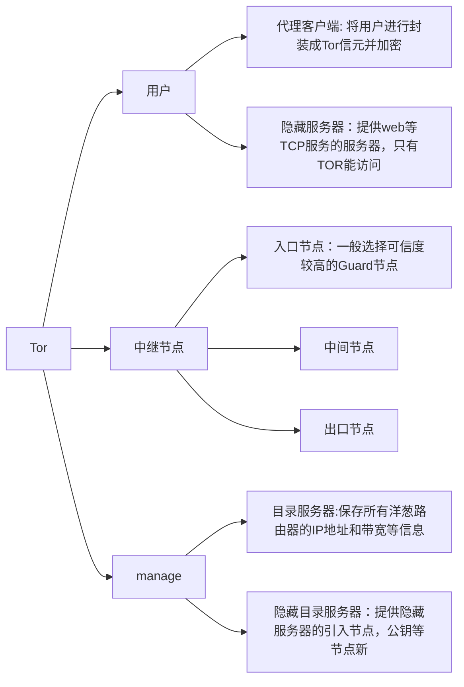
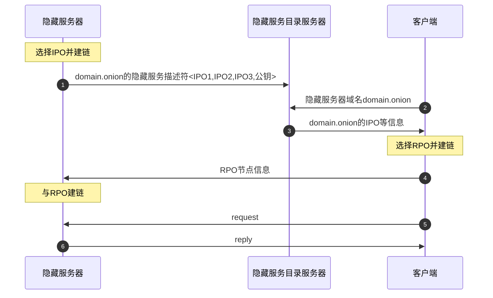
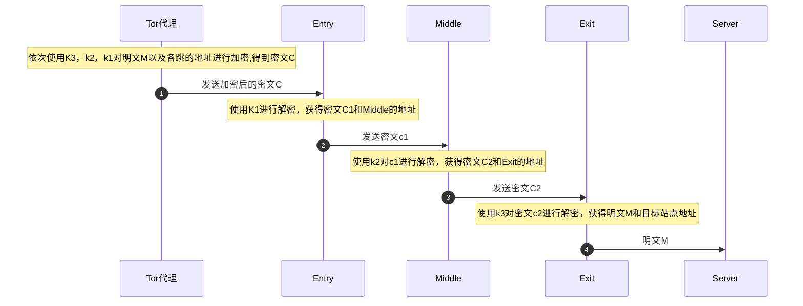

洋葱路由的基本组件：

Tor匿名通信网络结构

流程：

1. 隐藏服务器选择**3 个**洋葱路由器作为其**引
   入节点（IPO）**，并与引入节点建立3 跳链路;
2. 隐藏服务器将其**隐藏服务描述符(hidden
   service descriptor)** 上传至**隐藏服务目录服务器**，描
   述符中包含引入节点的信息与自身RSA 公钥;
3. 客户端通过隐藏服务域名(<z>.onion) 进行
   访问时，从**隐藏服务目录服务器**获取引入节点的相
   关信息;
4. 客户端选择**一个**洋葱路由器作为**汇聚节点（RPO）**
   并与该节点建立3 跳链路;
5. 客户端建立到达**引人节点**的**3 跳链路**，并通
   过引人节点将**汇聚节点**的信息发送到隐藏服务器;
6. 隐藏服务器建立到达汇聚节点的3 跳链路，
   并对该链路进行认证;
7. 经过汇聚节点，客户端与隐藏服务器通过6
   跳链路进行交互.

Tor客户端，从目录服务器下载并解析共识文档，从中可以解析出所有中继节点信息

中继节点信息

用户选择三个节点，中继节点层层加密信息

连接建立过程：

通过DH算法交换中间节点的密钥K，建立过程为（来自：[1]王付刚. TOR匿名通信技术研究[D].哈尔滨工业大学,2010.）

匿名通信主要过程

1. tor代理从目录服务器获取路由节点信息
2. Tor代理使用**路由选择算法**选择3个路由节点建立电路，并通过Diffie-Hellman算法分别与这三个节点生成共享密钥K1，K2，K3。根据位置，称为入口节点，中间节点，出口节点（Exit）
3. Tor代理依次使用K3，K2，K1对消息M进行加密，路由节点依次使用K1，k2，k3进行解密，最终将原文发送给目标站点

通过使用circleID可以唯一的识别一段链路，这样通过<entry,output,circleID>这样的形式，server就可以将消息会送给客户端。服务器也不知道具体的内容和ip。

疑问：

路由节点怎么记录上一跳和下一跳的地址

参考：

[1]王付刚. TOR匿名通信技术研究[D].哈尔滨工业大学,2010.
