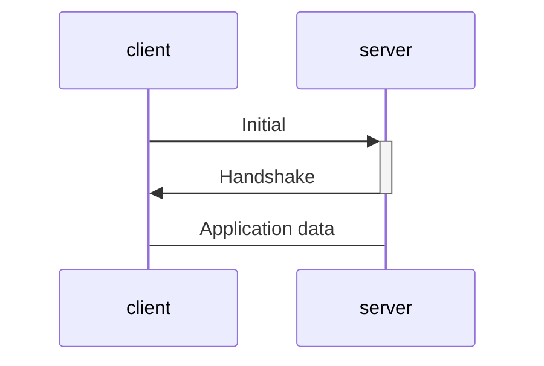
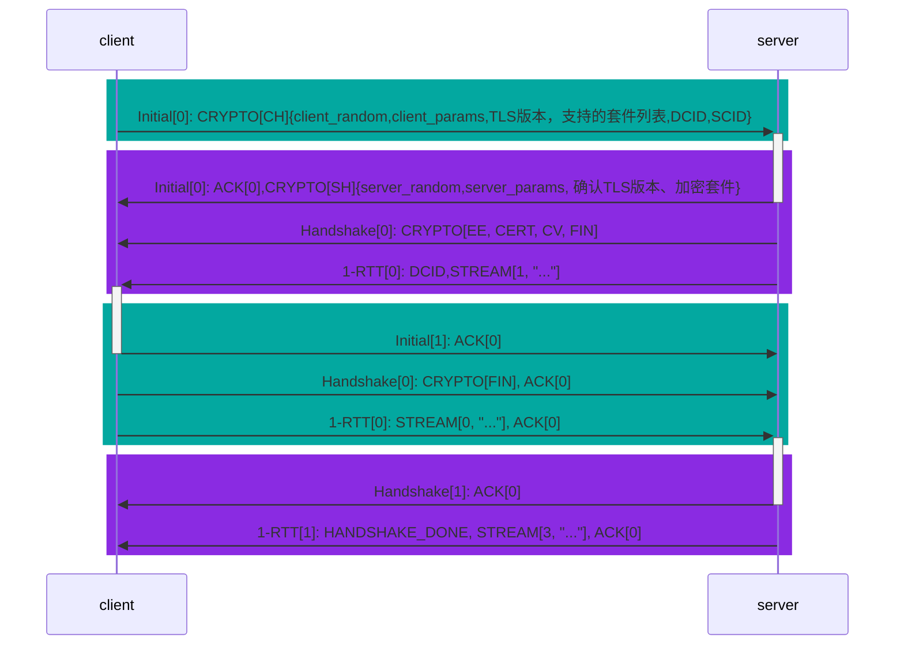
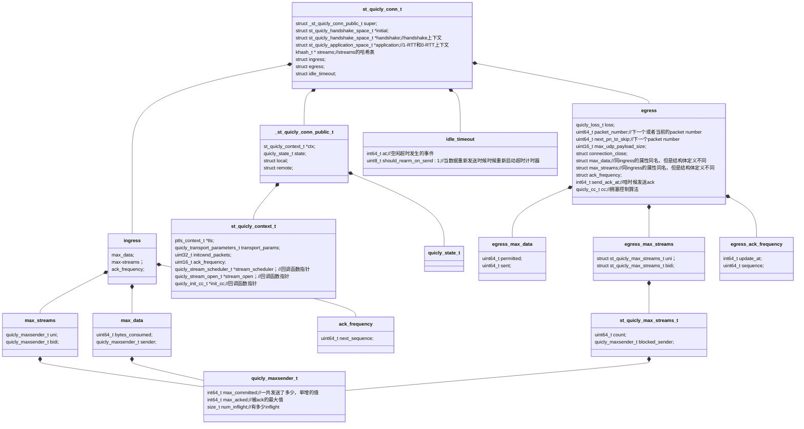
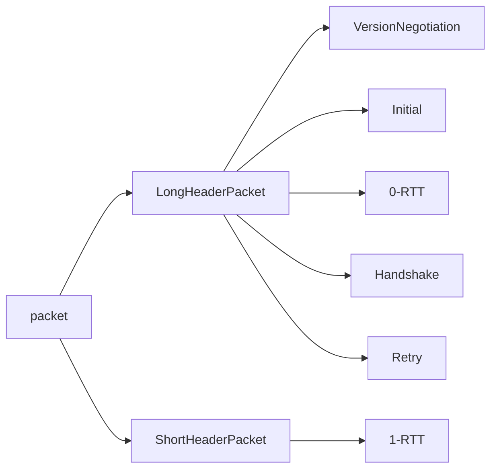

#  连接握手

具体流程参考：RFC9001



## 主机身份标识：connectionID

### 使用IP地址标识主机的弊端

在移动互联网中，ip地址可能随时都会变，使用ip地址标识一个主机明显不太适合，因此需要一种新的手段来标识一个主机。

### 使用connectionID标识主机的思路

假设用64bit标识一个主机，则可以使用前32字节标识主机，后32位标识是哪个终端发送的消息。这样就替换了原来的ip+端口号来进行身份标识的方案。前32位相当于ip，后32位相当于端口号。

因此使用connectionid进行主机和终端的身份标识的方案为：

- 每个连接都有一组connectionID（CID），接收方有一套CID，发送方也有一套CID
- 终端选择一个CID与对方进行通信，同一个主机不同终端虽然选择不同的CID，但是其前X位都相同，因此可以判断是来自同一个主机。同时，一个终端也可以使用多个CID，提高安全性

### 使用CID的基本过程

#### 更新CID

LongHeaderPacket头部字段中有**DCID**和**SCID**两个cid，因此如果要更新CID，可以选择的一种方案就是将**SCID**的值修改为自己要使用新的**CID**。


要更新connectionID，进行连接迁移，可以使用**new_connection_ID**帧来实现。

## 握手阶段的主要工作

1. 协商connectionID
2. 使用initial包进行密钥交换
3. 使用handshake包传输公钥证书等，

## 1-RTT握手

1-RTT的基本实现方案：原本一个TCP包发送一个SYN等数据，现在一个UDP数据报就可以包含多个quic packet了。

（每行表示一个quic packet）

``` 
   Client                                                  Server

   Initial[0]: CRYPTO[CH] ->

                                    Initial[0]: CRYPTO[SH] ACK[0]
                          Handshake[0]: CRYPTO[EE, CERT, CV, FIN]
                                    <- 1-RTT[0]: STREAM[1, "..."]

   Initial[1]: ACK[0]
   Handshake[0]: CRYPTO[FIN], ACK[0]
   1-RTT[0]: STREAM[0, "..."], ACK[0] ->

                                             Handshake[1]: ACK[0]
            <- 1-RTT[1]: HANDSHAKE_DONE, STREAM[3, "..."], ACK[0]
```


握手过程示意图：



### client -> server1

 发送第一个**initial**包，包中仅有一个**CRYPTO**帧，帧中只有一个**Client Hello**消息。


第一个**INITIAL** 包中，需要发送的主要信息及其功能为：

| 信息        | 功能                                           |
| ----------- | ---------------------------------------------- |
| DCID=SCID   | 向服务器协商CID                                |
| ClientHello | 定义支持的密码学算法和用于计算对称密钥的随机数 |

``` c++
class ClientHello{
   unsigned char version;//TLS协议版本
    char[][] cipherSuites;//支持的加密套件
    unsigned char[32] clientRandom;//DH密钥交换中用来计算对称密钥的随机数
}
```

此阶段中，client选择一个CID作为自己的SCID，但是不知道server的CID，又不好意思空着，因此把server的CID填成和自己的CID一样。

### server-> client1

#### initial中serverHello的内容

Server Hello 的包结构和 Client Hello 差不多.。

``` c++
class ServerHello{
    unsigned char version;//选择一个TLS版本
    unsigned char[32] clientRandom;//DH密钥交换中用来计算对称密钥的随机数
    char[] cipherSuites;//选择一个密码算法
}
```

在此阶段中，server选择一个CID作为自己的CID，并通过LongHeaderPacket的头部告诉client。


## 0-RTT握手

``` 
 Client                                                  Server

   Initial[0]: CRYPTO[CH]
   0-RTT[0]: STREAM[0, "..."] ->

                                    Initial[0]: CRYPTO[SH] ACK[0]
                                     Handshake[0] CRYPTO[EE, FIN]
                             <- 1-RTT[0]: STREAM[1, "..."] ACK[0]

   Initial[1]: ACK[0]
   Handshake[0]: CRYPTO[FIN], ACK[0]
   1-RTT[1]: STREAM[0, "..."] ACK[0] ->

                                             Handshake[1]: ACK[0]
            <- 1-RTT[1]: HANDSHAKE_DONE, STREAM[3, "..."], ACK[1]
```

## 连接建立的过程


| 数据结构                       | 作用                                                 |
| ------------------------------ | ---------------------------------------------------- |
| quicly_transport_parameters_t; | 传输层的配置信息                                     |
| st_quicly_context_t            | connection的上下文环境，包括各种回调函数和各种初始值 |
|                                |                                                      |

**每个**连接都有**一组connectionID**，每一个CID都可以标识该连接，每个**终端**都可以独立选择自己的CID供对端口使用。（实现端口的复用）

``` c
typedef struct st_quicly_cid_plaintext_t {
    uint32_t master_id;//cid相当于组号
    uint32_t path_id : 8;//标识终端
    uint32_t thread_id : 24;//记录thread
    uint64_t node_id;
} quicly_cid_plaintext_t;
```




# packet

## packet类型

两种数据包

| 数据包类别   | 特点                                            | 用途                                                        |
| ------------ | ----------------------------------------------- | ----------------------------------------------------------- |
| 长包头数据包 | 长包头数据包是在确立1-RTT密钥之前收发的数据包。 | 使得特殊数据包，如果Version negotiation包以统一的长度来表示 |
| 短包头数据包 | 建立1-RTT连接之后发送的数据报                   | 主要发送应用数据                                            |



### 不同包的作用和传输内容


| 包头长度 | 包类型              | 作用                                                         | 传输的内容                   |
| -------- | ------------------- | ------------------------------------------------------------ | ---------------------------- |
| 长包头   | version negotiation | 进行版本协商,客户端收到后，将Version字段值为0的数据包识别为Version Negotiation包。Version Negotiation包**仅由服务端**发送，是在收到不支持版本的客户端数据包时回的响应。 | 版本协商                     |
|          | initial             | 1. 携带客户端和服务端发送的第一个CRYPTO帧以执行**密钥交换**，双向都可携带ACK帧<br />2. 协商connectionID | 握手参数传输                 |
|          | 0-RTT               | 0-RTT包用于将**early数据**从客户端发往服务端，在Handshake完成之前。一旦开始处理来自服务端的0-RTT包，客户端不得发送0-RTT包 | 1. 握手参数<br />2. 应用数据 |
|          | Handshake           | 它用于携带来自服务端和客户端的**加密握手消息和确认**。       |                              |
|          | retry               | 携带由服务端生成的地址验证令牌,仅由希望进行重试的服务端使用  | 认证客户端地址合法性         |
| 短包头   | 1-RTT               | 在版本协商和1-RTT密钥协商后使用，传输应用数据                | 应用数据                     |

### 三种包号空间

三种包号空间

| 空间             | 为谁所用             | 加密方法                                   |
| ---------------- | -------------------- | ------------------------------------------ |
| initial          | 所有initial packet   | AEAD，密钥可见，只保护完整性，不保护机密性 |
| Handshake        | 所有handshake packet | 公钥加密                                   |
| Application data | 0-RTT和1-RTT包       | 对称加密                                   |


## 两种packet头部

### short packet header

短包头的包只有1RTT包。特点是只有DCID而没有SCID

``` c++
class 1RTT{
Header Form [1] = 0,//短包头or长包头
  Fixed Bit [1] = 1,
  Spin Bit [1],//自旋位
  Reserved Bits [2],
  Key Phase [1],//秘钥阶段，表示密钥时段
  Packet Number Length [2],//包号长度
  Destination Connection ID [0..160],//目的连接ID（DCID）
  Packet Number [8..32],
  Packet Payload [8..],
}
```

### long packet header

特点是既有DCID，也有SCID。

``` c
struct   LongHeaderPacket {
     Header Form (1) = 1,//头类型，长包头 or 短包头
     Fixed Bit (1) = 1,
     Long Packet Type (2),//长报文类型，initial or handshake or retry or 0RTT
     Type-Specific Bits (4),
     Version (32),
     Destination Connection ID Length (8),//DCID长度
     Destination Connection ID (0..160),//目的连接ID（DCID）
     Source Connection ID Length (8),//SCID字段的字节长度
     Source Connection ID (0..160),//源连接ID（SCID），SCID可以用来设置new CID
     Type-Specific Payload (..),
   }
```

#### initial包额外字段

``` c
struct initial{
    struct LongHeaderPacket longheader;
    Token Length (i),//令牌长度，变长整数，指定Token字段的长度，以字节为单位
  	Token (..),//令牌，先前在Retry包或NEW_TOKEN帧中提供的令牌值
  	Length (i),
  	Packet Number (8..32),
  	Packet Payload (8..),
}
```

#### 0RTT包

``` c
struct 0RTT{
    struct LongHeaderPacket longheader;
  	Length (i),//包号长度
  	Packet Number (8..32),//包号
  	Packet Payload (8..),
}
```

#### handshake包

``` c
struct handshake{
    struct LongHeaderPacket longheader;
  	Length (i),//包号长度
  	Packet Number (8..32),//包号
  	Packet Payload (8..),
}
```


# Frame

## 帧的性质-所在包以及特性

| Frame Type Name      | Pkts | Spec |
| :------------------- | :--- | :--- |
| PADDING              | IH01 | NP   |
| PING                 | IH01 |      |
| ACK                  | IH_1 | NC   |
| RESET_STREAM         | __01 |      |
| STOP_SENDING         | __01 |      |
| CRYPTO               | IH_1 |      |
| NEW_TOKEN            | ___1 |      |
| STREAM               | __01 | F    |
| MAX_DATA             | __01 |      |
| MAX_STREAM_DATA      | __01 |      |
| MAX_STREAMS          | __01 |      |
| DATA_BLOCKED         | __01 |      |
| STREAM_DATA_BLOCKED  | __01 |      |
| STREAMS_BLOCKED      | __01 |      |
| NEW_CONNECTION_ID    | __01 | P    |
| RETIRE_CONNECTION_ID | __01 |      |
| PATH_CHALLENGE       | __01 | P    |
| PATH_RESPONSE        | ___1 | P    |
| CONNECTION_CLOSE     | ih01 | N    |
| HANDSHAKE_DONE       | ___1 |      |


### pks-帧可能出现的包

* I：   Initial（第17.2.2小节）
* H：   Handshake（第17.2.4小节）
* 0：   0-RTT（第17.2.3小节）
* 1：   1-RTT（第17.3.1小节）
* ih：  只有0x1c类型的CONNECTION_CLOSE帧可以出现在Initial或Handshake包中。

### spec 控制帧类型处理或生成的任何特殊规则

* N：仅包含带有此标记的帧的数据包不是ACK触发包，参见第13.2节：只有ACK触发包（ACK触发）会导致在ACK发送窗口期内发送ACK帧。非ACK触发包仅在因其他原因发送ACK帧时才被确认。
* C：出于拥塞控制目的，仅包含带有此标记的帧的数据包，不计入传输中的字节数计算，见[QUIC-RECOVERY]。
* P：仅包含带有此标记的帧的数据包，可用于在连接迁移期间探测新的网络路径，参见第9.1节。
* F：带有此标记的是流控帧，参见第4章。


## 不同类型帧的作用

一个**packets**可以包括多个**frames**。本节主要是讨论**QUIC**帧的格式及其语义。几种帧的作用如下表：

| 帧                         | 作用                                                         |
| -------------------------- | ------------------------------------------------------------ |
| PADDING frame              | 填充，使得数据包达到规定的最小值                             |
| PING frame                 | 其对端是否仍然存在或检查对端的可达性。                       |
| ACK Frames                 |                                                              |
| STOP_SENDING Frames        | **STOP_SENDING请求对端停止在该流上发送数据**                 |
| **CRYPTO**                 | **传输加密握手消息**                                         |
| NEW_TOKEN帧                | 给客户端提供一个令牌，以便在未来连接发送Initial包时在报文中携带 |
| **STREAM Frames**          | **隐式地创建一个流并携带流数据**                             |
| MAX_DATA Frames            | **用于流控，以通知对端其可以在整个连接上发送的最大数据量。** |
| MAX_STREAM_DATA            | 用于流控，以通知对端其可以在该流上发送的最大数据量。         |
| MAX_STREAMS                | 双向流,通知**对端其允许打开的给定类型的流的累积个数**        |
|                            | 单向流,通知**对端其允许打开的给定类型的流的累积个数**        |
| DATA_BLOCKED Frames        | DATA_BLOCKED帧可用作流控算法调整的输入,指示阻塞发生时的连接级别的流量限制值。 |
| STREAM_DATA_BLOCKED Frames | 流级别,指示发生阻塞时流的偏移量.                             |
| STREAMS_BLOCKED            | 发送方想打开的流数量超出了设置的最大个数限制,                |
| NEW_CONNECTION_ID Frames   | 为其对端提供替代CID，这些CID可用于在迁移连接时打破可关联性   |
| RETIRE_CONNECTION_ID       | **指示它将不再使用由其对端发布的指定CID**                    |
| PATH_CHALLENGE             | 检查对端的可达性以及用于连接迁移期间的路径验证。             |
| PATH_RESPONSE              | 以响应PATH_CHALLENGE帧                                       |
| CONNECTION_CLOSE Frames    | 通知其对端连接正在关闭                                       |
| HANDSHAKE_DON              | 向客户端发出握手确认信号                                     |

## 几种重要的帧


### ACK帧
``` c++
ACK Frame {
  Type (i) = 0x02..0x03,
  Largest Acknowledged (i),
  ACK Delay (i),
  ACK Range Count (i),
  First ACK Range (i),
  ACK Range (..) ...,
  [ECN Counts (..)],
}
```

### CRYPTO

``` c
CRYPTO Frame {
  Type (i) = 0x06,
  Offset (i),//偏移，变长整数，指定此CRYPTO帧中数据在流中的字节偏移量。
  Length (i),//* 长度，变长整数，指定此CRYPTO帧中加密数据字段的长度。
  Crypto Data (..),//加密数据，加密消息数据负载。
}
```

### STREAM

``` c
STREAM Frame {
  Type (i) = 0x08..0x0f,
  Stream ID (i),
  [Offset (i)],//偏移，变长整数，指定此STREAM帧中数据在流中的字节偏移量,当OFF位设置为1时，此字段存在。当Offset字段不存在时，偏移量为0。
  [Length (i)],//长度，变长整数，指定此STREAM帧中Stream Data字段的长度,该字段在LEN位设置为1时出现。当LEN位设置为0时，数据包中的所有剩余字节都是流数据。
  Stream Data (..),//流数据，该流中要传输的字节。
}
```

