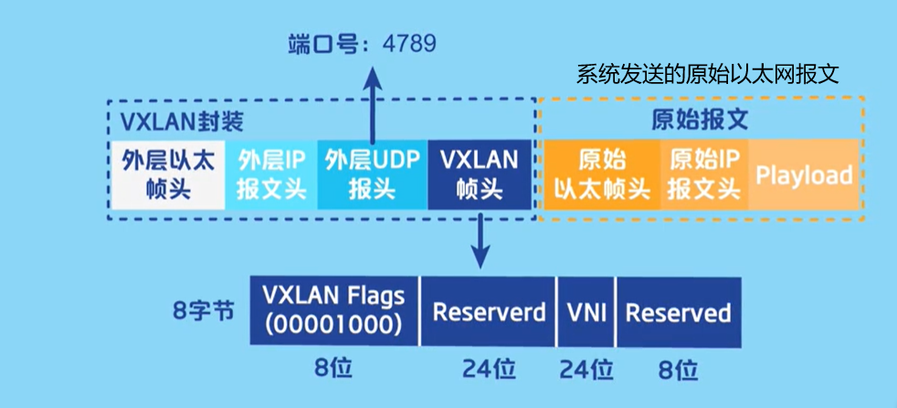

VXLAN（Virtual eXtensible Local Area Network，虚拟扩展局域网），是由IETF定义的NVO3（Network Virtualization over Layer 3）标准技术之一，是对传统VLAN协议的一种扩展。VXLAN的特点是**将L2的以太帧封装到UDP报文（即L2 over L4）中，并在L3网络中传输。**
(UDP数据报并不会对数据进行分片处理)

 VXLAN是一种隧道技术

 # 隧道技术
 ## 隧道中VXLAN帧的转发过程
 使用外层封装的IP地址和物理MAC地址在物理网络中进行传输
 ## 基本概念
 ### VTEP
 **VTEP（VXLAN Tunnel Endpoints，VXLAN隧道端点）**:是VXLAN网络的**边缘设备**，是VXLAN隧道的起点和终点，VXLAN**对用户原始数据帧的封装和解封**装均在VTEP上进行。

 VTEP既可以是一台**独立的网络设备**（比如华为的CloudEngine系列交换机），也可以是在服务器中的**虚拟交换机**

### VNI
**VNI(VXLAN Network Identifier，VXLAN 网络标识符)**:VNI是一种类似于VLAN ID的用户标识.

# VXLAN帧的封装过程

1. 系统发送原始的,在虚拟以太网上发送的原始数据帧
2. VXLAN进行封装

封装之后的VXLAN数据帧,在隧道中进行透明传输,然后再在VTEP进行解封装